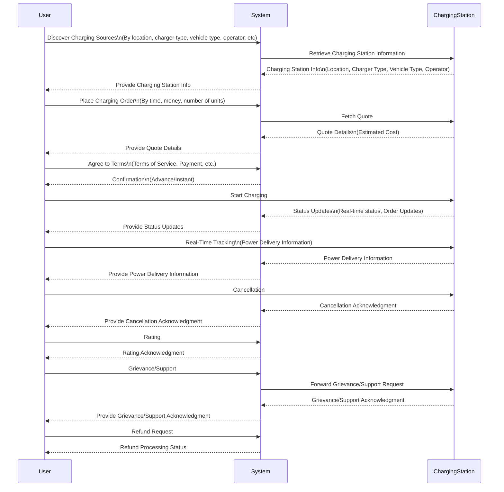

<!-- ## 1. Discovery of Charging Sources -->

```mermaid
sequenceDiagram
    participant User
    participant System
    participant ChargingStation

    User->>System: Discover Charging Sources\n(By location, charger type, vehicle type, operator, etc)
    System->>ChargingStation: Retrieve Charging Station Information
    ChargingStation-->>System: Charging Station Info\n(Location, Charger Type, Vehicle Type, Operator)
    System-->>User: Provide Charging Station Info

## 2. Placing an Order for Charge 

    User->>System: Place Charging Order\n(By time, money, number of units)
    System->>ChargingStation: Fetch Quote
    ChargingStation-->>System: Quote Details\n(Estimated Cost)
    System-->>User: Provide Quote Details

    User->>System: Agree to Terms\n(Terms of Service, Payment, etc.)
    System-->>User: Confirmation\n(Advance/Instant)

## 3. Fulfillment of a Charging Order

    User->>ChargingStation: Start Charging
    ChargingStation-->>System: Status Updates\n(Real-time status, Order Updates)
    System-->>User: Provide Status Updates

    User->>ChargingStation: Real-Time Tracking\n(Power Delivery Information)
    ChargingStation-->>System: Power Delivery Information
    System-->>User: Provide Power Delivery Information

    User->>ChargingStation: Cancellation
    ChargingStation-->>System: Cancellation Acknowledgment
    System-->>User: Provide Cancellation Acknowledgment

## 4. Post-Charging Interactions

    User->>System: Rating
    System-->>User: Rating Acknowledgment

    User->>System: Grievance/Support
    System->>ChargingStation: Forward Grievance/Support Request
    ChargingStation-->>System: Grievance/Support Acknowledgment
    System-->>User: Provide Grievance/Support Acknowledgment

    User->>System: Refund Request
    System-->>User: Refund Processing Status

```