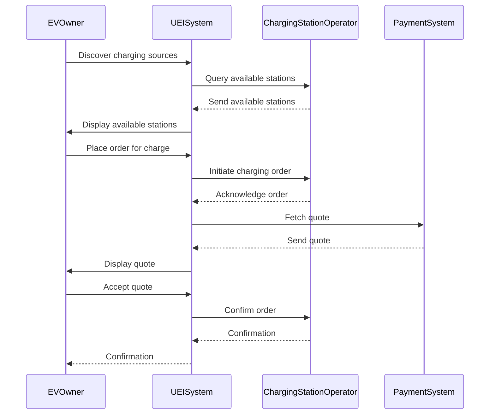
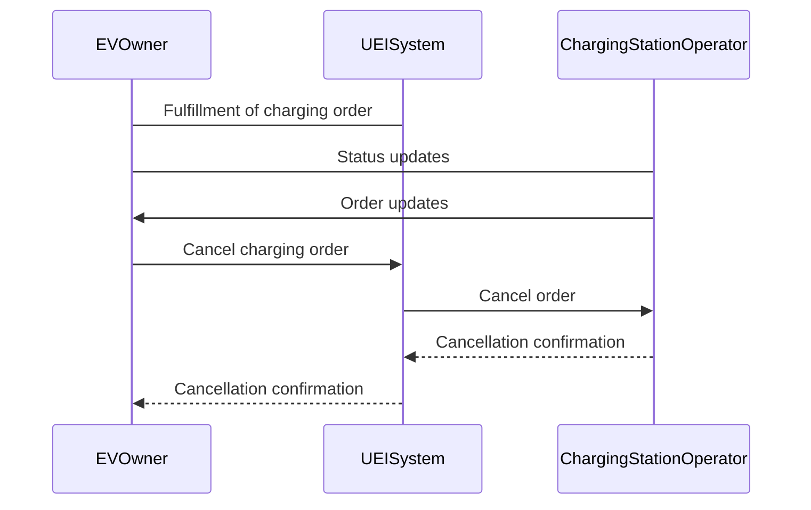
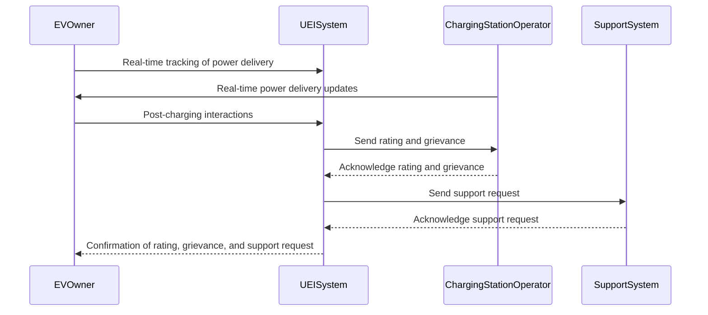
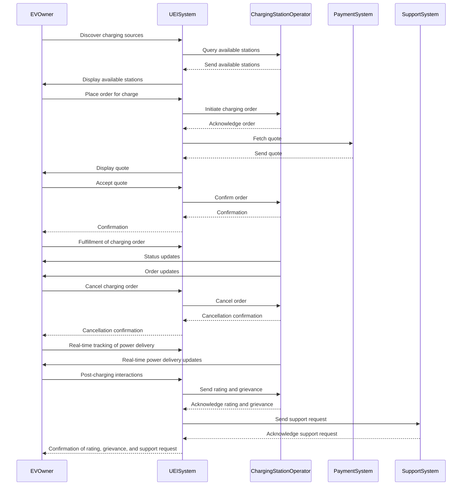

# Use Case Document for EV Charging Transaction

This technical use case document outlines the checkout process for an online shopping cart system. It details the interactions between users and the system, ensuring a clear wireframe for developers while meeting the business goals of using **Beckn for Energy.** By defining actors, user goals, stakeholders, pre-conditions, basic flows, exceptions, variations, and alternative flows, this document serves as a comprehensive guide for development and testing, ensuring the robustness and reliability for the developers. 

> This use-case document follows the following order:
> 1. **Actors (Users)**
>2. **User Goals**
>3. **Stakeholders**
>4. **Pre-conditions**
>5. **Basic Workflow**
>6. **Exception to the Basic Workflow**
>7. **Variations or What-if Scenarios**
>8. **Alternative Flows**

# 1. Discovery of charging sources: 

This use case focuses on the efficient allocation of charging stations for public electric vehicles (PUEVs) to address the **imbalance between demand and supply.** By considering factors such as mileage, PUEV distribution, and passenger distribution, the goal is to **optimize the placement of charging stations** to enhance sharing and utilization levels. The use of a Non-deterministic Polynomial (NP) model and agent-based simulations aids in identifying optimal locations.

## Introduction

1. **By location:**
-   Urban areas: City centers, parking lots, shopping centers.
-   Suburban areas: Residential neighborhoods, office complexes.
-   Rural areas: Gas stations, rest stops, tourist attractions.
-   Highways: Service areas, rest stops, fast-food chains.

2. **By charger Type:**

-   Level 1: Standard household outlets (120 volts).
-   Level 2: Dedicated charging stations (240 volts).
-   DC Fast Charging: High-powered stations (480 volts or more).

3. **By vehicle Type:**

-   Electric Vehicles (EVs): Fully battery-powered vehicles.
-   Plug-in Hybrid Electric Vehicles (PHEVs): Combine internal combustion engines with electric propulsion systems.
-   Hydrogen Fuel Cell Vehicles (FCVs): Use hydrogen to generate electricity on board.

4. **By operator:**

-   Public Charging Networks: Companies like ChargePoint, EVgo, and Blink offering public charging stations.
-   Private Networks: Businesses, hotels, and shopping malls with their own charging infrastructure.
-   Government Initiatives: Municipalities and government agencies installing chargers as part of sustainability efforts.

______________
### Actors (Users):
 1. Urban Planners
 2. Electric Vehicle Operators
 3. Public Transit Authorities

### Actor goals:
1. Identify optimal locations for electric vehicle charging stations.
2. Improve the efficiency and utilization of existing charging infrastructure.
3. Balance demand and supply of charging services across different locations.

### Stakeholders:

1. Electric Vehicle Owners
2. Government Agencies
3. Environmental Organizations
4. Charging Station Operators

### Preconditions:

-     Data on PUEV distribution and passenger distribution is available.    
-     Information on existing charging station locations and capacities is accessible.
-     Relevant geographic and demographic data is collected and analyzed.

### Basic workflow:

1.  Data Collection:
    -   Gather data on Plug-in Electric Vehicle (PUEV) distribution, passenger distribution, and existing charging station locations.
2.  Model Utilization:
    -   Utilize the NP model to minimize total vehicle service distance and optimize charging station locations.
3.  Simulation:  
    -   Simulate the optimized charging station locations using an agent-based model.
4.  Evaluation:
    -   Evaluate the effectiveness of the optimized locations in balancing demand and supply of charging service.

### Exception to the basic workflow:

1. Insufficient or inaccurate data may lead to suboptimal charging station locations.
2. External factors such as regulatory constraints or budget limitations may impact the implementation of optimized locations.

### Variations or what-if scenarios

1. Different urban environments may require adjustments to the optimization model.
2. Technological advancements in electric vehicle batteries or charging infrastructure may influence charging station location preferences.

### Alternative flows:

1. In cases where immediate optimization is not feasible, incremental improvements to existing charging station locations can be made.
2. Collaboration with private entities or community organizations to host charging stations in non-traditional locations, such as retail parking lots or residential areas.

# 2. Placing an order for charge: 

In response to the growing demand for electric vehicle (EV) charging infrastructure, the adoption of EV Charging Management Systems (CMS) has become crucial. This use case explores how implementing an EV Charging Management System can streamline operations and improve workflow for charging station operators. By integrating various functionalities like scheduling, billing, and data analytics, this system aims to **optimize the process of placing an order for charge.**

## Introduction

1. **By time:**
 - Charging schedule 
 - Time frame for charging session 
 - Preferred charging time slots 
 - Requested charging start time

 2.  **By money:**
- Total cost of charging session
- Payment methods accepted (credit card, mobile payment, subscription)
- Additional fees (if any)
- Charging rates (per kWh, per hour)
    
 3.  **By number of units:**
    
 - Quantity of charging sessions
 - Volume of energy to be charged (kWh)
 - Minimum and maximum charging durations
 - Bulk charging options (multiple sessions discounts)
    
 4.  **By specifications:**
- Charging station specifications (DC fast charging, Level 2, power output)
- Connector types (CHAdeMO, CCS, Type 2)
-  Vehicle compatibility requirements
- Reservation options for specific charging stations
    
 5.  **By location:**
- Charging station location preferences (nearby, along route)
- Charging station availability based on geographical area
- Routing preferences for EVs with multiple charging stops
- Remote start/stop charging feature for mobile app users
______________
### Actors (Users):
1. Electric vehicle owners (Common people)
2. Electric vehicle company owners

### User Goals:

1.  Conveniently initiate and schedule charging sessions for their electric vehicles.
2.  Ensure transparency and clarity regarding the cost and payment methods associated with charging services.
3.  Minimize downtime by efficiently accessing available charging stations.

### Stakeholders:
1.  Electric Vehicle Charging Station Operators
2.  Electric Vehicle Manufacturers
3.  Electric Utility Companies

### Pre-conditions:

-     Relevant charging station information, including availability and pricing, is accessible through an online platform or mobile application.
-     The user's electric vehicle is compatible with the charging station's specifications.

### Basic workflow:
1.  Electric vehicle owner accesses the online platform or mobile application of the charging station operator.
2.  The user selects the option to initiate a new charging session.
3.  The user specifies the desired parameters for the charging session, including:
    -   Preferred start time
    -   Duration of the session
    -   Charging station location (if applicable)
4.  The system calculates the total cost of the charging session based on the selected parameters and applicable pricing structure.
5.  The user selects the preferred payment method from the available options, which may include:
    -   Credit card
    -   Mobile payment
    -   Subscription-based billing
6.  Upon confirmation of the order, the system reserves the selected charging station and schedules the charging session.
7.  The user receives a confirmation message with details of the reserved charging session, including:
    -   Date and time
    -   Location
    -   Total cost
    -   Payment method
8.  The user proceeds to the reserved charging station at the scheduled time to commence the charging session.

### Exception to the Basic workflow:

1.  If the selected charging station becomes unavailable or out of service, the system notifies the user and provides alternative options.
2.  In case of technical issues or system downtime, the user may experience delays in accessing the charging services.

### Variations or What-if Scenarios:

1.  Different pricing structures may be implemented based on factors such as time of day, charging station location, or membership status.
2.  Future enhancements to the system may include predictive analytics to recommend optimal charging times and locations based on user preferences and historical usage data.

### Alternative Flows:

1.  Users may have the option to initiate an immediate charging session without specifying a start time, subject to availability.
2.  Collaborations with third-party service providers, such as ride-sharing companies or parking facilities, may offer integrated charging services as part of their offerings.

# 3. Fetching a quote
With the upcoming of electric vehicles, there is a need for streamlined processes to obtain pricing information for charging services. 

## Introduction
The use of **standardized protocols, such as the Beckn protocol, facilitates the exchange of quote requests** and responses between EV drivers and charging station operators.
______________
### Actors:
1. Customer: Entity seeking to obtain a quote for a service or product.
2. Service Provider: Entity responsible for offering the service or product and generating the quote.

### User goals:
1.  To successfully submit an order for desired goods or services.
2.  To ensure accuracy and completeness of the order information.
3.  To receive confirmation of the order submission.

### Stakeholders:

1.  Customer: Directly involved in placing the order.
2.  Order Fulfillment Team: Responsible for processing and fulfilling orders.
3.  Sales and Marketing Team: Provides product information and promotional offers.
4.  Customer Support Team: Assists customers with order-related queries and issues.

### Pre-conditions:
-     Customer must have access to the order management system.
-     Customer must have selected the desired items or services to be included in the order.
-     Customer must have provided necessary information for order processing, such as shipping address and payment details.

### Basic workflow:

1.  Customer accesses the order management system through a web portal or mobile application.
2.  Customer selects the desired items or services to be included in the order.
3.  Customer provides necessary information for order processing, including:
    -   Quantity of items
    -   Shipping address
    -   Payment method
    -   Preferred delivery date (if applicable)
4.  Customer reviews the order details for accuracy and completeness.
5.  Customer submits the order through the order management system.
6.  The order management system processes the order and generates a confirmation message.
7.  Customer receives the confirmation message indicating successful submission of the order.

### Exception to the Basic workflow:

1.  If any required information is missing or invalid, the order management system prompts the customer to provide the necessary details before proceeding.
2.  Technical issues or system downtime may result in delays or failures in order submission and confirmation.

### Variations or What-if Scenarios:

1.  Customers may have different preferences for shipping methods and delivery options.
2.  Pricing variations or promotional offers may affect the final cost of the order.
3.  International orders may require additional steps for customs clearance and international shipping.

### Alternative Flows:

1.  If the desired items are out of stock, the order management system may offer alternative products or notify the customer when the items become available.
2.  Customers may have the option to save their orders as drafts and revisit them later for completion.
3.  In cases where online ordering is not feasible, customers may place orders through alternative channels such as phone or email.

# 4. Terms of service
The Terms of Service **outline the legal agreement between the service provider and the customer**, defining the rules, obligations, and responsibilities associated with using the service or purchasing products. It covers various aspects such as payment methods, cancellation policies, refunds, dispute resolution, governing law, and any other relevant terms and conditions. Customers are required to read and agree to these terms before using the service or making a purchase, ensuring transparency and compliance with legal requirements.

## Introduction

-   **Payment:**
    -   Accepted Payment Methods:
        -   Credit card
        -   Debit card
        -   PayPal
        -   Bank transfer
    -   Payment Schedule:
        -   Full payment upfront
        -   Partial payment with balance due upon delivery
        -   Installment plans available for certain purchases
    -   Currency:
        -   USD
        -   EUR
        -   GBP
        -   Others as specified
-   **Cancellation:**
    -   Cancellation Policy:
        -   Full refund available if canceled within 24 hours of purchase
        -   Partial refund subject to cancellation fees after 24 hours
        -   No refund available for cancellations made after shipping
    -   Cancellation Methods:
        -   Online cancellation form
        -   Phone call to customer support
        -   Email notification to designated address
-   **Refunds:**
    -   Refund Eligibility:
        -   Defective or damaged products
        -   Incorrect items shipped
        -   Order cancellation within specified timeframe
    -   Refund Process:
        -   Refunds processed within 7-10 business days of approval
        -   Refund amount credited back to original payment method
        -   Refund confirmation sent to customer via email
    -   Refund Exceptions:
        -   Refunds not available for digital downloads or services rendered
        -   Restocking fees may apply for certain returned items
        -   Refunds subject to inspection and approval by management
-   **Miscellaneous Terms:**
    -   Dispute Resolution:
        -   Arbitration clause requiring disputes to be settled through arbitration
        -   Exclusion of class-action lawsuits
    -   Governing Law:
        -   Jurisdiction specified (e.g., state, country)
        -   Applicable laws and regulations outlined
    -   Amendments:
        -   Terms subject to change with prior notice to customers
        -   Continued use of services implies acceptance of updated terms
______________
### Actors:
1. Customer
2. Service Provider

### User goals:
1.  Understand the terms and conditions associated with using the service or purchasing products.
2.  Agree to the terms and proceed with using the service or making a purchase.

### Stakeholders:

1.  Customers: Directly impacted by the terms of service.
2.  Service Providers: Responsible for drafting and enforcing the terms.
3.  Legal Advisors: Provide guidance on legal implications and compliance.

### Pre-conditions:

-     Service provider must have defined terms of service.
-     Customers must agree to the terms before accessing the service or making a purchase.

### Basic workflow:

1.  Customer accesses the terms of service section on the service provider's website or platform.
2.  Customer reads through the terms and conditions carefully.
3.  Customer acknowledges understanding of the terms by clicking an "Agree" button or checkbox.
4.  Service provider records customer's agreement to the terms and allows access to the service or proceeds with the purchase.

### Exception to the Basic workflow:

1.  If the customer does not agree to the terms, they are prevented from accessing the service or making a purchase.
2.  If there are any discrepancies or conflicts in the terms, the customer may request clarification from the service provider.

### Variations or What-if Scenarios:

1.  Different services or products may have specific terms tailored to their nature (e.g., software license agreements, subscription terms).
2.  International customers may be subject to additional terms and conditions due to legal or regulatory requirements in their respective countries.

### Alternative Flows:

1.  Customers may choose to negotiate specific terms with the service provider, especially in business-to-business transactions.
2.  Service providers may offer options for customers to request modifications to the standard terms based on their unique circumstances.

# 5. Confirmation
The confirmation process **ensures that customers receive acknowledgment and assurance regarding their bookings or transactions.** Whether it's an advance confirmation for future arrangements or an instant confirmation for immediate transactions, this process aims to provide customers with timely and accurate information about their bookings or purchases. It involves communication between the customer and the service provider, with the service provider confirming the details of the booking or transaction and the customer acknowledging receipt of the confirmation. This process enhances customer confidence and satisfaction by offering clarity and certainty throughout the booking or transaction process.
## Introduction
**Instant confirmation:**

-   Customers receive immediate confirmation of their booking or transaction upon submission.
-   Confirmation details, including date, time, and booking reference, are instantly provided.
-   Typically used for transactions that require immediate action or where real-time availability is essential.

**Advance confirmation:**

-   Customers receive confirmation of their booking or transaction well in advance of the scheduled date.
-   Allows customers to plan ahead and make necessary arrangements based on the confirmed booking details.
-   Commonly used for events, appointments, or reservations that require advanced planning and preparation.
______________
### Actors (Users):

 1. Customer
 2. Service Provider

### User Goals:

1.  To receive timely and accurate confirmation of the booking or transaction.
2.  To ensure that the confirmation details align with the expectations and requirements.

### Stakeholders:

1.  Customers: Directly impacted by the confirmation process.
2.  Service Providers: Responsible for issuing confirmations and managing bookings or transactions.
3.  Support Staff: Assist customers and service providers with confirmation-related queries.

### Pre-conditions:

-     Customer must have initiated a booking or transaction.
-     Service provider must have the capability to confirm bookings or transactions.

### Basic workflow:
1.  Customer initiates a booking or transaction through the service provider's platform.
2.  Service provider processes the booking or transaction request.
3.  Depending on the type of confirmation:
    -   **Instant Confirmation:**
        -   Service provider immediately confirms the booking or transaction upon submission by the customer, providing instant confirmation details.
    -   **Advance Confirmation:**
        -   Service provider sends an advance confirmation message to the customer, confirming the booking or transaction and providing details such as date, time, and booking reference.
4.  Customer receives the confirmation message via email, SMS, or through the service provider's platform.
5.  Customer reviews the confirmation details for accuracy and completeness.

### Exception to the Basic workflow:

1.  If there are any discrepancies or issues with the booking or transaction, the service provider may need to manually review and confirm the request.
2.  Technical glitches or system failures may result in delays or failures in sending the confirmation message to the customer.

### Variations or What-if Scenarios:

1.  Different types of confirmations may be offered based on the nature of the booking or transaction (e.g., hotel reservations, event bookings, online purchases).
2.  Customers may have the option to request modifications or cancellations to confirmed bookings or transactions, leading to additional confirmation processes.
### Alternative Flows:

1.  Customers may opt for automated confirmations through the service provider's platform, bypassing the need for manual confirmation messages.
2.  In cases where instant confirmation is not feasible, customers may receive provisional confirmation messages with pending approval status until final confirmation is obtained from the service provider.

# 6. Fulfillment of a charging order
Stakeholders, including EV owners and charging station operators, **collaborate to ensure a seamless charging experience**, with options for order updates, cancellations, and real-time tracking of power delivery.
## Introduction
  
The fulfillment of a charging order involves the process of initiating, scheduling, and executing a charging session for electric vehicles (EVs) through a Unified Energy Interface (UEI) system. EV owners can use this system to select parameters such as start time, duration, and preferred charging station, receiving real-time updates on the charging session's status and power delivery. 
______________
### Actors (Users):

 1. Electric Vehicle (EV) Owner
 2. Charging Station Operator
 3. Unified Energy Interface (UEI) System

### User Goals:

1.  Initiate and schedule charging sessions for their electric vehicles.
2.  Receive real-time updates on the status of the charging session.
3.  Have the ability to cancel or modify the charging order if necessary.
4.  Track the real-time delivery of power to their electric vehicles.

### Stakeholders:

1.  EV Owners: Directly impacted by the charging order fulfillment process.
2.  Charging Station Operators: Responsible for fulfilling charging orders and managing charging stations.
3.  UEI System Developers: Develop and maintain the UEI platform for seamless interactions between EV owners and charging station operators.

### Pre-conditions:

-     EV owner must have access to the UEI platform or application.
-     Charging station operator must have available charging stations and power supply.
-     EV must be compatible with the charging station specifications.

### Basic workflow:

1.  EV owner accesses the UEI platform or application to initiate a charging order.
2.  EV owner selects the desired parameters for the charging session, including start time, duration, and preferred charging station.
3.  UEI system sends the charging order request to the selected charging station operator.
4.  Charging station operator receives the request and confirms the availability of the selected charging station.
5.  Upon confirmation, charging station operator initiates the charging session, and power delivery to the EV begins.
6.  EV owner receives real-time status updates on the charging session, including charging progress and estimated time to completion.
7.  EV owner has the option to cancel or modify the charging order if needed.
8.  Once the charging session is complete, charging station operator notifies the EV owner, and power delivery to the EV ceases.

### Exception to the Basic workflow:

1.  If the selected charging station is unavailable or out of service, charging station operator notifies the EV owner and suggests alternative charging options.
2.  Technical issues or disruptions in power supply may result in delays or interruptions in the charging session.

### Variations or What-if Scenarios:

1.  Different charging stations may offer varying charging rates or pricing structures, leading to differences in the total cost of the charging session.
2.  EV owners may request additional services or amenities during the charging session, such as access to Wi-Fi or charging station reservations.

### Alternative Flows:

1.  In cases where the selected charging station becomes unavailable after confirmation, charging station operator may automatically redirect the charging order to the next available station.
2.  EV owners may have the option to track the real-time location of their electric vehicles during the charging session through the UEI platform.

# 7. Status Updates, Order Updates, Cancellation, and Real-Time Tracking of Power Delivery
Under this topic the managing electric vehicle (EV) charging sessions, focusing on status updates, order updates, cancellation, and real-time tracking of power delivery is outlined. It describes how EV owners, charging station operators, and the Unified Energy Interface (UEI) system interact to ensure a seamless charging experience. **Through real-time updates and notifications, EV owners can stay informed** about their charging sessions and make necessary adjustments as needed. Additionally, the document addresses potential exceptions, variations, and alternative scenarios to accommodate different use cases and scenarios.
## Introduction

**Status Update:**
- Regular notifications to EV owners about the progress of their charging sessions.
- Updates on charging session initiation, progress, and completion.
- Notifications regarding any interruptions or issues during the charging process.
- Real-time monitoring of charging status, including charging rate and estimated time to completion.

**Order Update:**
- Notifications to EV owners about any changes or updates to their charging orders.
- Updates on charging station availability, pricing, or charging rates.
- Information about alternative charging options in case of station unavailability.
- Confirmation of any modifications or adjustments made to the original charging order.

**Cancellation:**
- Ability for EV owners to cancel their charging orders if needed.
- Confirmation of cancellation and any associated refund processes.
- Notifications to charging station operators about canceled orders to release the station for other users.
- Options for rescheduling or modifying canceled charging orders based on availability.

**Real-Time Tracking of Power Delivery:**
- Continuous monitoring of power delivery from the charging station to the EV.
- Real-time updates on energy consumption and charging progress.
- Notifications about any fluctuations or interruptions in power delivery.
- Visual representation of power delivery metrics, such as charging rate and energy transferred, for EV owners to track during the session.
______________
### Actors (Users):

 1. Electric Vehicle (EV) Owner: 
 2. Charging Station Operator: 
 3. Unified Energy Interface (UEI) System: 

### User Goals:

1.  Receive real-time updates on the status of the charging session.
2.  Stay informed about any changes or updates to the charging order.
3.  Have the ability to cancel the charging order if necessary.
4.  Track the real-time delivery of power to their electric vehicles.

### Stakeholders:

1.  EV Owners: Directly impacted by the charging session status and updates.
2.  Charging Station Operators: Responsible for managing and operating charging stations.
3.  UEI System Developers: Develop and maintain the UEI platform for seamless interactions between EV owners and charging station operators.

### Pre-conditions:

-     EV owner must have access to the UEI platform or application.
-     Charging station operator must have available charging stations and power supply.
-     EV must be compatible with the charging station specifications.

### Basic workflow:

1.  EV owner initiates a charging session through the UEI platform or application.
2.  UEI system sends the charging order request to the selected charging station operator.
3.  Charging station operator confirms the availability of the selected charging station and initiates the charging session.
4.  EV owner receives real-time status updates on the charging session, including charging progress and estimated time to completion.
5.  If there are any updates or changes to the charging order (e.g., charging station availability, charging rates), the UEI system notifies the EV owner.
6.  EV owner has the option to cancel the charging order if needed, either through the UEI platform or by contacting the charging station operator.
7.  Once the charging session is complete, charging station operator notifies the EV owner, and power delivery to the EV ceases.

### Exception to the Basic workflow:

1.  If the selected charging station becomes unavailable after confirmation, charging station operator notifies the EV owner and suggests alternative charging options.
2.  Technical issues or disruptions in power supply may result in delays or interruptions in the charging session.

### Variations or What-if Scenarios:

1.  Different charging stations may offer varying charging rates or pricing structures, leading to differences in the total cost of the charging session.
2.  EV owners may request additional services or amenities during the charging session, such as access to Wi-Fi or charging station reservations.

### Alternative Flows:

1.  In cases where the selected charging station becomes unavailable after confirmation, charging station operator may automatically redirect the charging order to the next available station.
2.  EV owners may have the option to track the real-time location of their electric vehicles during the charging session through the UEI platform.

# 8. Post-Charging Interactions: Rating, Grievance, and Support
Under this topic is outlined the post-charging interactions between electric vehicle (EV) owners and charging station operators, focusing on rating, grievance, and support processes. 
## Introduction
After completing a charging session, **EV owners have the opportunity to provide feedback and ratings on their experience**, submit grievances or support requests for any issues encountered, and receive timely resolutions from the charging station operators. Through these interactions, stakeholders aim to enhance service quality, address customer concerns, and improve overall satisfaction in the EV charging ecosystem.
______________
### Actors (Users):
- Electric Vehicle (EV) Owner: Provides feedback and support requests after the charging session.
- Charging Station Operator: Receives feedback and addresses support requests from EV owners.
- Unified Energy Interface (UEI) System: Facilitates post-charging interactions between EV owners and charging station operators.

### User Goals:
1. Provide ratings and feedback on the charging experience to improve service quality.
2. Submit grievances or support requests in case of any issues or concerns during or after the charging session.
3. Receive timely responses and resolutions to their grievances or support requests.

### Stakeholders:
1. EV Owners: Provide valuable feedback to charging station operators and UEI system developers.
2. Charging Station Operators: Receive feedback and address support requests to enhance customer satisfaction.
3. UEI System Developers: Analyze feedback and support requests to improve the UEI platform and user experience.

### Pre-conditions:
-     EV owner must have completed a charging session through the UEI platform or application.
-     Charging station operator must have established channels for receiving feedback and support requests from EV owners.

### Basic workflow:
1. EV owner completes the charging session and receives a prompt to provide feedback and ratings on the experience.
2. EV owner rates the charging session based on factors such as charging speed, station cleanliness, and overall satisfaction.
3. EV owner has the option to provide additional comments or suggestions for improvement.
4. Upon submission, the feedback is transmitted to the UEI system and shared with the respective charging station operator.
5. Charging station operator receives the feedback and acknowledges receipt through the UEI platform.
6. If the EV owner submits a grievance or support request, the UEI system forwards the request to the charging station operator.
7. Charging station operator investigates the grievance or support request and provides a timely response or resolution to the EV owner.
8. EV owner receives confirmation of the resolution and has the option to provide additional feedback or close the support request.

### Exception to the Basic workflow:
1. If the charging station operator fails to acknowledge or respond to the feedback or support request within a specified timeframe, the UEI system escalates the issue to higher authorities for resolution.
2. In case of unresolved grievances or dissatisfaction with the resolution provided by the charging station operator, EV owner may escalate the issue further through designated channels provided by the UEI system.

### Variations or What-if Scenarios:
1. Different charging stations may have varying procedures or response times for handling feedback and support requests.
2. Advanced analytics and sentiment analysis may be employed by the UEI system to categorize and prioritize feedback and support requests based on their urgency and severity.

### Alternative Flows:
1. EV owners may have the option to provide anonymous feedback if they prefer not to disclose their identity.
2. Charging station operators may proactively reach out to EV owners to address any issues or concerns reported during the charging session, enhancing customer service and satisfaction.

# Sequence (UML) diagram

Mermaid UML : https://mermaidjs.github.io/

**Diagram 1: Discovery and Order Placement**

**Diagram 2: Fulfillment and Cancellation**

**Diagram 3: Real-time Tracking and Post-charging Interactions**

**Diagram 4: Final combined sequence diagram**

