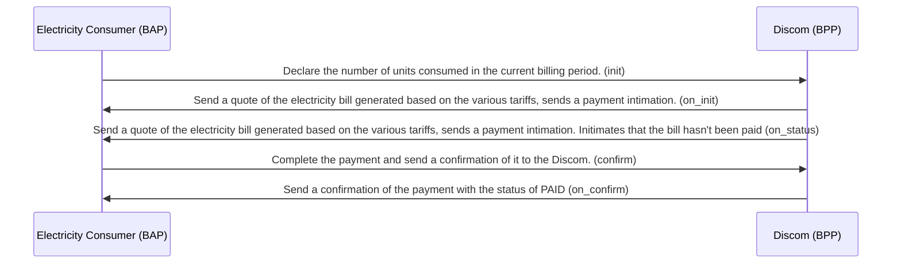

## Homes purchasing energy from the discoms

### init and on_init

The consumer of the electricity services declares the number of units they have consumed in the billing cycle based on the meter reading. The number of units are sent to the pre-selected BPP (in this case) and the BPP calculates a quote and sends the amount to be paid for the units consumed. The amount is calculated based on the various tariffs and the taxes.

The fulfillment details and the billing details can be sent in the `init` request to declare the customer's address and their customer ID.

The `on_init` sends a payment link for the customer to complete the payment.

### confirm and on_confirm

The customer pays the bill off the network and sends a `confirm` call intimating to the BPP that the payment has been made. The Discom (BPP) replies with an `on_confirm`, confirming the status of the fulfillment and the payment status.

### status and on_status

The `on_status` can be sent to the user to remind them of an upcoming un-paid bill.

### codes for status updates

- `bill-paid`
- `bill-unpaid`

### Limitations

This use case doesn't cover the case of cancelling the power connection.
