# EV Charging Application Workflow #1

## Overview

This document outlines the workflow for Electric Vehicle (EV) Charging using the DENT Protocol. The workflow includes interactions between the charging point operator (BPP) and the BAP for search, select, block, and completing the session.

Bear in mind that this is just an example workflow for a simple EV Charing and Battery swap workflow between a `User` and a `Provider`.
(Note: Here, User -> Electric Vehicle Owner/User and Provider -> EV Charging Provider)

A typical workflow for EV Charging consists of the following steps:

#### Step 1: The BAP searches for EV Chargers

The BAP provides specific requirements to find the nearest EV Chargers to charge their EV
The search can be based on the location, location and the energy requirements or location, energy requirements and charger details.

#### Step 2: Provider sends catalogs of EV Chargers nearby

The provider platform (BPP) sends the catalogs of all nearby charging providers to the BAP.
The catalog will consist of various charging stations with their respective attributes such as charging types, connector types, power rating.

> **Note**: The BPP is not expected to run an inventory check before it sends out their catalogs. They are free to send out their entire catalogs, but if a BAP has a request with specific timing, they can send the appropraite catalogs. The BPP can also choose to send add ons in their catalogs that the BAP can avail.

#### Step 3: The BAP selects a EV Charger Service

Selects the provider which satisfies user requirements.
In this stage, The BAP may select additional features such as:

1. The BAP can select his required services (such as EV Charging) from the catalog of provider
2. The BAP can block/reserve the charger/swap service for a certain time slot, along with the start and duration times of the session.
3. The BAP can select the charger type he wants to use such as A.C. or D.C. and Connector types like CCS2 etc.,
4. The BAP can select quantity of energy required in units of kwh.
5. The BAP can select the provider based on a location that helps them fulfill their intent.

#### Step 4: Provider sends quoted price

The provider will receive the order based on the BAP's requirements.
The user gets the quoted price, including the breakdown of the price details.
The breakdown should include:

- Tariff per unit (i.e., INR/KWh), the tariff per unit might change by the service type, charger type and location of Energy Charger Provider
- Price for reservation

Apart from this, the provider can include add ons to the items for the BAP, these add ons can be services that can be availed in that location. In the case of EV charging it could be free car wash, free tyre pressure check etc.

Providers can also include discounts to the items based on partnerships or subscriptions.

#### Step 5: The BAP initiates the order

The BAP initializes the order by providing billing details, apart from the details of the items chosen.
Here, the BAP will provide their `Name`, `Email ID` and `Phone Number` and updates the payment details

The BAP can send vehicle details to avail add ons and offers for that particular vehicle type or company.

#### Step 6: Provider sends draft order

The provider sends the draft order with the payment and fulfilment terms to the user-side.
Based on how much units of Electrical Energy user used during charging as tariff_per_unit as already mentioned above in INR/KWh
If the user also done the reservation/block the transaction includes the price for block/use-up price as well
The tariff_per_unit might change with the charger type as we know that A.C. charger type has different price compared to D.C. charger type.

During this interaction, the BPP can block the charger for the specified amount of time at that particular price and wait for a confirm call. The quote will no longer be valid after a certain amount of time. The quote would have to be re-calculated for a new order.
The BPP sends the payment link, the BAP uses the link to complete the payment.

#### Step 7: The BAP confirms the order

The BAP sees the draft order and confirms it by agreeing to the payment and fulfilment terms and conditions
The confirm status will sent to the provider saying that user has paid the price and satisfied the fulfillment terms, the order will also have instructions on how to connect to the charger.

#### Step 8: Provider sends the order activation

The provider will activate the order when the user updates the provider to start the charging.

#### Step 9: User checks the status of the order

The BAP requests to check the updates/status of their order, this can include the percentage of charge completed.

#### Step 10: Provider sends the status of the order

The provider will send the order updates with current status to the BAP

#### Step 11: The BAP or the provider cancels the order.

The BAP or the provider can cancel the order for various reasons. The provider can cancel the order if there is failure on their side, in which case the appropriate refund will be processed.

## Search (Searching for EV Chargers)

1. The user declares the intent for EV Charging to the providers
2. Providers publish the catalog of their services

### User-side Actions

A EV user can declare their intent for charging their EV in many ways like:

- Searching for EV Charging Providers based on current location of user
- Searching for EV Charging Providers based on quantity required
- Searching for EV Charging based on Name/Code of provider
- Searching for EV Charging Providers based on ratings
- View list of energy sources, such as EV chargers, Solar Farms providing EV charging, Houses providing EV charging, Battery Swap Providers etc.

### Provider-side Actions

In this interaction, the Provider publishes their catalog of services and products. A Provider can publish various types of catalogs like

- Publish list of energy sources and EV chargers including Solar Farms providing EV charging, Houses, Battery Swap Providers etc.
- Publish list of provders in 5Km radius of user
- Publish list of provders with the requested Charing types/Connector types/Battery types
- Publish catalog/details of services provided by providers
- Publish catalog of services provided by a particular provider

### Logical Workflow

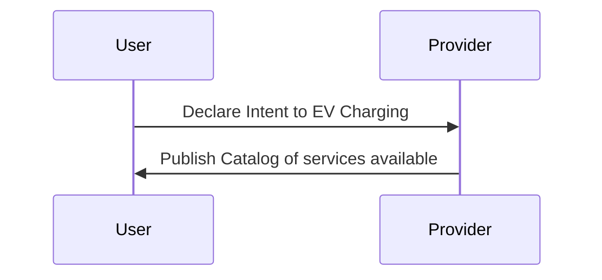

### Beckn Protocol API Workflow

In beckn protocol, the search intent generated by the EV User Platform (BAP) is typically published on the gateway (BG) that broadcasts the intent to multiple Provider platforms (BPPs). Each of the BPPs return their catalogs directly to the BAP via asynchronous callbacks. The workflow for that is shown below.

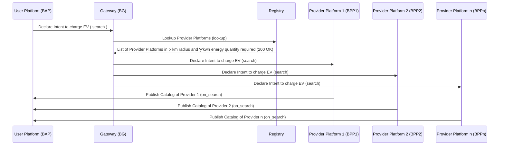

#### Example `search` api Json:

```json
{
  "context": {
    "domain": "dent:0.1.0",
    "action": "search",
    "location": {
      "country": {
        "name": "India",
        "code": "IND"
      }
    },
    "city": "std:080",
    "version": "1.1.0",
    "bap_id": "example-bap.com",
    "bap_uri": "https://api.example-bap.com/pilot/bap/energy/v1",
    "transaction_id": "6743e9e2-4fb5-487c-92b7-13ba8018f176",
    "message_id": "6743e9e2-4fb5-487c-92b7-13ba8018f176",
    "timestamp": "2023-07-16T04:41:16Z"
  },
  "message": {
    "intent": {
      "item": {
        "descriptor": {
          "code": "energy"
        },
        "quantity": {
          "required": {
            "value": "4.0",
            "unit": "kWH"
          }
        },
        "category": {
          "descriptor": {
            "code": "green-tariff"
          }
        }
      },
      "location": {
        "gps": "12.423423,77.325647",
        "radius": {
          "type": "CONSTANT",
          "value": "5",
          "unit": "km"
        }
      }
    }
  }
}
```

#### Example `on_search` api json:

```json
{
  "context": {
    "domain": "dent:0.1.0",
    "action": "on_search",
    "location": {
      "country": {
        "name": "India",
        "code": "IND"
      }
    },
    "city": "std:080",
    "version": "1.1.0",
    "bap_id": "example-bap.com",
    "bap_uri": "https://api.example-bap.com/pilot/bap/energy/v1",
    "bpp_id": "example-bpp.com",
    "bpp_uri": "https://api.example-bpp.com/pilot/bpp/",
    "transaction_id": "6743e9e2-4fb5-487c-92b7-13ba8018f176",
    "message_id": "6743e9e2-4fb5-487c-92b7-13ba8018f176",
    "timestamp": "2023-07-16T04:41:16Z"
  },
  "message": {
    "catalog": {
      "providers": [
        {
          "id": "chargezone.in",
          "descriptor": {
            "name": "Chargezone",
            "short_desc": "Chargezone Technologies Pvt Ltd",
            "images": [
              {
                "url": "https://chargezone.in/images/logo.png"
              }
            ]
          },
          "categories": [
            {
              "id": "1",
              "descriptor": {
                "code": "green-tariff",
                "name": "green tariff"
              }
            }
          ],
          "locations": [
            {
              "id": "1",
              "gps": "12.345345,77.389754"
            },
            {
              "id": "2",
              "gps": "12.247934,77.876987"
            }
          ],
          "items": [
            {
              "id": "pe-charging-01",
              "descriptor": {
                "code": "energy"
              },
              "price": {
                "value": "8",
                "currency": "INR / kWH"
              },
              "quantity": {
                "available": {
                  "measure": {
                    "value": "100",
                    "unit": "kWH"
                  }
                }
              },
              "category_ids": ["1"],
              "location_ids": ["1", "2"],
              "fulfillment_ids": ["1", "2"],
              "add_ons": [
                {
                  "id": "pe-charging-01-addon-1",
                  "descriptor": {
                    "name": "Free car wash"
                  },
                  "price": {
                    "value": "0",
                    "currency": "INR"
                  }
                }
              ]
            }
          ],
          "fulfillments": [
            {
              "id": "1",
              "type": "CHARGING",
              "stops": [
                {
                  "type": "start",
                  "time": {
                    "timestamp": "01-06-2023 10:00:00"
                  }
                },
                {
                  "type": "end",
                  "time": {
                    "timestamp": "01-06-2023 10:30:00"
                  }
                }
              ],
              "tags": [
                {
                  "descriptor": {
                    "name": "Charging Point Specifications"
                  },
                  "list": [
                    {
                      "descriptor": {
                        "name": "Charger type",
                        "code": "charger-type"
                      },
                      "value": "AC"
                    },
                    {
                      "descriptor": {
                        "name": "Connector type",
                        "code": "connector-type"
                      },
                      "value": "CCS2"
                    },
                    {
                      "descriptor": {
                        "name": "Power Rating"
                      },
                      "value": "greater than 50kW"
                    },
                    {
                      "descriptor": {
                        "name": "Availability"
                      },
                      "value": "Available"
                    }
                  ],
                  "display": true
                }
              ]
            },
            {
              "id": "2",
              "type": "CHARGING",
              "stops": [
                {
                  "type": "start",
                  "time": {
                    "timestamp": "01-06-2023 10:00:00"
                  }
                },
                {
                  "type": "end",
                  "time": {
                    "timestamp": "01-06-2023 10:30:00"
                  }
                }
              ],
              "tags": [
                {
                  "descriptor": {
                    "name": "Charging Point"
                  },
                  "list": [
                    {
                      "descriptor": {
                        "name": "Charger type"
                      },
                      "value": "AC"
                    },
                    {
                      "descriptor": {
                        "name": "Connector type"
                      },
                      "value": "CCS2"
                    },
                    {
                      "descriptor": {
                        "name": "Power Rating"
                      },
                      "value": "greater than 50kW"
                    },
                    {
                      "descriptor": {
                        "name": "Availability"
                      },
                      "value": "Available"
                    }
                  ],
                  "display": true
                }
              ]
            }
          ]
        },
        {
          "id": "log9.in",
          "descriptor": {
            "name": "Log9 Inc"
          },
          "categories": [
            {
              "id": "1",
              "descriptor": {
                "code": "green-tariff",
                "name": "green tariff"
              }
            }
          ],
          "items": [
            {
              "id": "pe-charging-01",
              "descriptor": {
                "code": "energy"
              },
              "price": {
                "value": "10",
                "currency": "INR / kWH"
              },
              "quantity": {
                "available": "1000"
              },
              "category_ids": ["1"],
              "fulfillment_ids": ["3", "4"],
              "add_ons": [
                {
                  "id": "pe-charging-01-addon-1",
                  "descriptor": {
                    "name": "Free tyre pressure check"
                  },
                  "price": {
                    "value": "0",
                    "currency": "INR"
                  }
                }
              ]
            }
          ],
          "fulfillments": [
            {
              "id": "3",
              "type": "BATTERY-SWAP",
              "stops": [
                {
                  "location": {
                    "gps": "12.745675, 77.987393"
                  }
                }
              ]
            },
            {
              "id": "4",
              "type": "MOBILE-BATTERY-SWAP",
              "stops": [
                {
                  "location": {
                    "url": "https://log9.in/track/bswap/3234242"
                  }
                }
              ]
            }
          ]
        }
      ]
    }
  }
}
```

## Select and Book Charging

1. User selects a EV Charge Provider from the list which satisfies the requirements
2. The provider sends the draft order with the quoted price to the User

### User-side Actions

- Selecting EV Charge Provider(s) after viewing catalogs
- Selecting to block/use-up charger (or) not. (Y/N)
- Selecting start and end time for block/use-up of charger service
- Selecting charger type (A.C./D.C.) and connector type

### Provider-side Actions

- Receive user's selection
- Requesting for block/use-up charger (Y/N)
- Requesting for time slot
- Requesting for charger type, connecter type, vehicle type and battery type
- Provider sends draft order for the selected EV charge with quoted price
- The price includes with a breakdown of `tariff_per_unit` , `Reservation Price`, `taxes`

### Logical Workflow

The below diagram illustrates the logical interactions between a EV user and Provider during the Selecting service/product stage

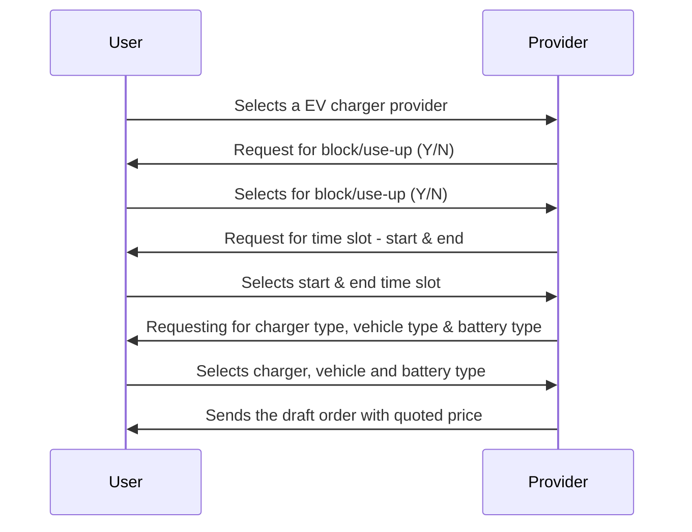

### Beckn Protocol API Workflow

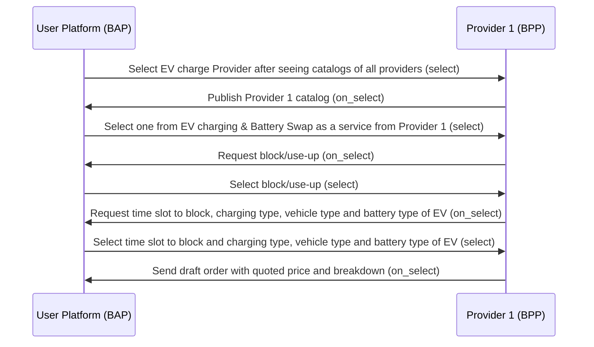

#### Example `select` api json:

```json
{
  "context": {
    "domain": "dent:0.1.0",
    "action": "select",
    "location": {
      "country": {
        "name": "India",
        "code": "IND"
      }
    },
    "city": "std:080",
    "version": "1.1.0",
    "bap_id": "example-bap.com",
    "bap_uri": "https://api.example-bap.com/pilot/bap/energy/v1",
    "bpp_id": "chargezone-energy-bpp.com",
    "bpp_uri": "https://api.example-bpp.com/pilot/bpp/",
    "transaction_id": "6743e9e2-4fb5-487c-92b7-13ba8018f176",
    "message_id": "6743e9e2-4fb5-487c-92b7-13ba8018f176",
    "timestamp": "2023-07-16T04:41:16Z"
  },
  "message": {
    "order": {
      "provider": {
        "id": "chargezone.in"
      },
      "items": [
        {
          "id": "pe-charging-01",
          "quantity": {
            "selected": {
              "measure": {
                "value": "4",
                "unit": "kWh"
              }
            }
          }
        }
      ]
    }
  }
}
```

#### Example `on_select` api json:

```json
{
  "context": {
    "domain": "dent:0.1.0",
    "action": "on_select",
    "location": {
      "country": {
        "name": "India",
        "code": "IND"
      }
    },
    "city": "std:080",
    "version": "1.1.0",
    "bap_id": "example-bap.com",
    "bap_uri": "https://api.example-bap.com/pilot/bap/energy/v1",
    "bpp_id": "example-bpp.com",
    "bpp_uri": "https://api.example-bpp.com/pilot/bpp/",
    "transaction_id": "6743e9e2-4fb5-487c-92b7-13ba8018f176",
    "message_id": "6743e9e2-4fb5-487c-92b7-13ba8018f176",
    "timestamp": "2023-07-16T04:41:16Z"
  },
  "message": {
    "order": {
      "providers": {
        "id": "chargezone.in",
        "descriptor": {
          "name": "Chargezone",
          "short_desc": "Chargezone Technologies Pvt Ltd",
          "images": [
            {
              "url": "https://chargezone.in/images/logo.png"
            }
          ]
        }
      },
      "items": [
        {
          "id": "pe-charging-01",
          "descriptor": {
            "code": "energy"
          },
          "price": {
            "value": "8",
            "currency": "INR/kWH"
          },
          "quantity": {
            "available": {
              "measure": {
                "value": "100",
                "unit": "kWh"
              }
            },
            "selected": {
              "measure": {
                "value": "4",
                "unit": "kWh"
              }
            }
          }
        },
        {
          "id": "pe-charging-01-addon-1",
          "descriptor": {
            "code": "add-on-item",
            "name": "Free car wash"
          },
          "price": {
            "value": "0",
            "currency": "INR"
          }
        }
      ],
      "fulfillments": [
        {
          "id": "1",
          "type": "CHARGING",
          "stops": [
            {
              "type": "start",
              "time": {
                "timestamp": "01-06-2023 10:00:00"
              }
            },
            {
              "type": "end",
              "time": {
                "timestamp": "01-06-2023 10:30:00"
              }
            }
          ],
          "tags": [
            {
              "descriptor": {
                "name": "Charging Point Specifications"
              },
              "list": [
                {
                  "descriptor": {
                    "name": "Charger type",
                    "code": "charger-type"
                  },
                  "value": "AC"
                },
                {
                  "descriptor": {
                    "name": "Connector type",
                    "code": "connector-type"
                  },
                  "value": "CCS2"
                },
                {
                  "descriptor": {
                    "name": "Power Rating"
                  },
                  "value": "greater than 50kW"
                },
                {
                  "descriptor": {
                    "name": "Availability"
                  },
                  "value": "Available"
                }
              ],
              "display": true
            }
          ]
        }
      ],
      "quote": {
        "price": {
          "value": "32",
          "currency": "INR"
        },
        "breakup": [
          {
            "item": {
              "descriptor": {
                "name": "Estimated units consumed"
              },
              "quantity": {
                "selected": {
                  "measure": {
                    "value": "4",
                    "unit": "kWh"
                  }
                }
              }
            },
            "price": {
              "value": "32",
              "currency": "INR"
            }
          },
          {
            "item": {
              "descriptor": {
                "name": "Free car wash"
              }
            },
            "price": {
              "value": "0",
              "currency": "INR"
            }
          }
        ]
      }
    }
  }
}
```

## Order Initialization

In this stage, the User provides the required information and initiates the order

### User-side Actions

- User provides the billing details `Name`, `Email ID` and `Phone Number`
- User updates the payment details and initiates the order

### Provider-side Actions

- Request for billing details
- Receive billing details from the user
- Send draft order with payment and fulfillment terms

### Logical Workflow

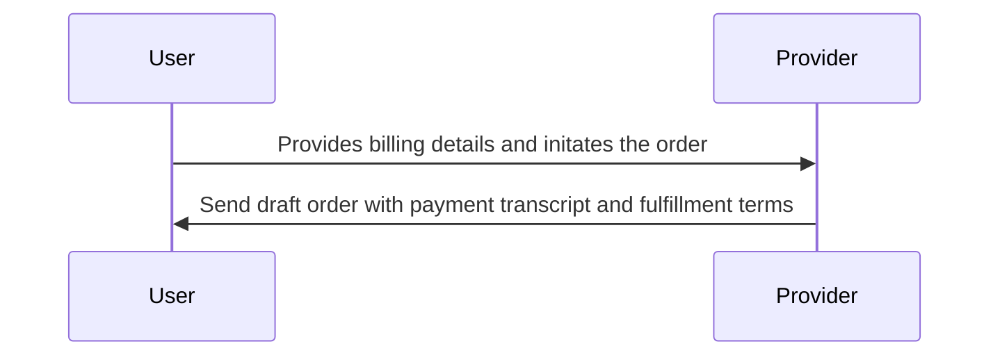

### Beckn Protocol API Workflow

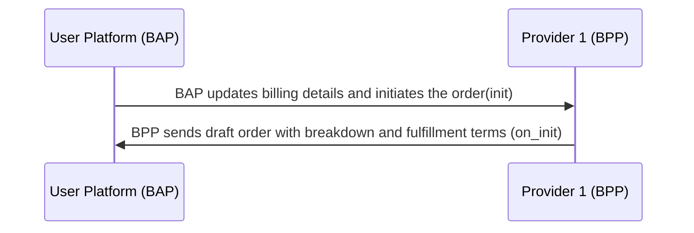

#### Example `init` api json:

```json
{
  "context": {
    "domain": "dent:0.1.0",
    "action": "init",
    "location": {
      "country": {
        "name": "India",
        "code": "IND"
      }
    },
    "city": "std:080",
    "version": "1.1.0",
    "bap_id": "example-bap.com",
    "bap_uri": "https://api.example-bap.com/pilot/bap/energy/v1",
    "bpp_id": "chargezone-energy-bpp.com",
    "bpp_uri": "https://api.example-bpp.com/pilot/bpp/",
    "transaction_id": "6743e9e2-4fb5-487c-92b7-13ba8018f176",
    "message_id": "6743e9e2-4fb5-487c-92b7-13ba8018f176",
    "timestamp": "2023-07-16T04:41:16Z"
  },
  "message": {
    "order": {
      "provider": {
        "id": "chargezone.in"
      },
      "items": [
        {
          "id": "pe-charging-01"
        }
      ],
      "billing": {
        "name": "John Doe",
        "email": "abc@example.com",
        "phone": "+91-9876522222"
      },
      "fulfillments": [
        {
          "id": "1",
          "customer": {
            "person": {
              "name": "John Doe"
            },
            "contact": {
              "phone": "+91-9887766554"
            }
          }
        }
      ]
    }
  }
}
```

#### Example `on_init` api json:

```json
{
  "context": {
    "domain": "dent:0.1.0",
    "action": "on_init",
    "location": {
      "country": {
        "name": "India",
        "code": "IND"
      }
    },
    "city": "std:080",
    "version": "1.1.0",
    "bap_id": "example-bap.com",
    "bap_uri": "https://api.example-bap.com/pilot/bap/energy/v1",
    "bpp_id": "example-bpp.com",
    "bpp_uri": "https://api.example-bpp.com/pilot/bpp/",
    "transaction_id": "6743e9e2-4fb5-487c-92b7-13ba8018f176",
    "message_id": "6743e9e2-4fb5-487c-92b7-13ba8018f176",
    "timestamp": "2023-07-16T04:41:16Z"
  },
  "message": {
    "order": {
      "providers": {
        "id": "chargezone.in",
        "descriptor": {
          "name": "Chargezone",
          "short_desc": "Chargezone Technologies Pvt Ltd",
          "images": [
            {
              "url": "https://chargezone.in/images/logo.png"
            }
          ]
        }
      },
      "items": [
        {
          "id": "pe-charging-01",
          "descriptor": {
            "code": "energy"
          },
          "price": {
            "value": "8",
            "currency": "INR/kWH"
          },
          "quantity": {
            "available": {
              "measure": {
                "value": "100",
                "unit": "kWh"
              }
            },
            "selected": {
              "measure": {
                "value": "4",
                "unit": "kWh"
              }
            }
          },
          "fulfillments": ["1"]
        }
      ],
      "fulfillments": [
        {
          "id": "1",
          "customer": {
            "person": {
              "name": "John Doe"
            },
            "contact": {
              "phone": "+91-9887766554"
            }
          },
          "type": "CHARGING",
          "state": {
            "descriptor": {
              "code": "order-initiated"
            }
          },
          "stops": [
            {
              "type": "start",
              "time": {
                "timestamp": "01-06-2023 10:00:00"
              }
            },
            {
              "type": "end",
              "time": {
                "timestamp": "01-06-2023 10:30:00"
              }
            }
          ],
          "tags": [
            {
              "descriptor": {
                "name": "Charging Point"
              },
              "list": [
                {
                  "descriptor": {
                    "name": "Charger type"
                  },
                  "value": "AC"
                },
                {
                  "descriptor": {
                    "name": "Connector type"
                  },
                  "value": "CCS2"
                },
                {
                  "descriptor": {
                    "name": "Power Rating"
                  },
                  "value": "greater than 50kW"
                },
                {
                  "descriptor": {
                    "name": "Availability"
                  },
                  "value": "Available"
                }
              ],
              "display": true
            }
          ]
        }
      ],
      "billing": {
        "email": "abc@example.com",
        "number": "+91-9876522222"
      },
      "quote": {
        "price": {
          "value": "32",
          "currency": "INR"
        },
        "breakup": [
          {
            "item": {
              "descriptor": {
                "name": "Estimated units consumed"
              },
              "quantity": {
                "selected": {
                  "measure": {
                    "value": "4",
                    "unit": "kWh"
                  }
                }
              }
            },
            "price": {
              "value": "32",
              "currency": "INR"
            }
          }
        ]
      },
      "payments": [
        {
          "url": "https://payment.gateway.in",
          "type": "PRE-ORDER",
          "status": "NOT-PAID",
          "params": {
            "amount": "40",
            "currency": "INR"
          },
          "time": {
            "range": {
              "start": "2023-08-10T10:00:00Z",
              "end": "2023-08-10T10:30:00Z"
            }
          }
        }
      ],
      "cancellation_terms": [
        {
          "fulfillment_state": {
            "descriptor": {
              "code": "charging-start"
            }
          },
          "cancellation_fee": {
            "percentage": "30%"
          },
          "external_ref": {
            "mimetype": "text/html",
            "url": "https://chargezone.in/charge/tnc.html"
          }
        }
      ]
    }
  }
}
```

## Fulfillment (Payment and Order Confirmation and Cancellation)

User will check the order details and confirms the order with payment (might also update the order)
Post payment user will activates the confirmed order

### User-side Actions

- Confirms(\updates) the order by agreeing to fulfillment terms

### Provider-side Actions

- Receive order confirmation from the user
- Send active confirmed order to the user

## Status Updates and Monitoring

### User-side Actions

- Request to fetch the latest status of the order

#### Provider-side Actions

- Provide the latest status of the order to the user

### Logical Worklow

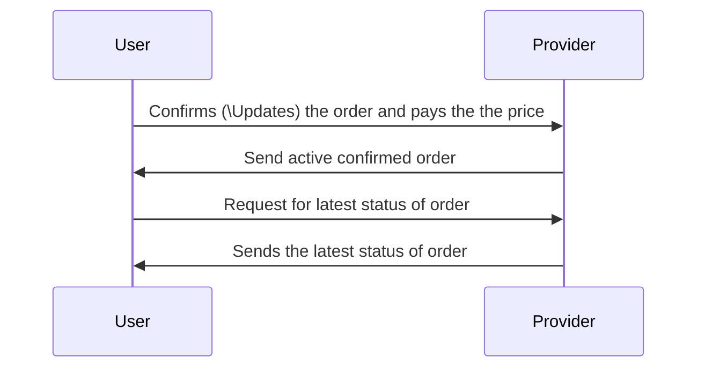

### Beckn API Workflow

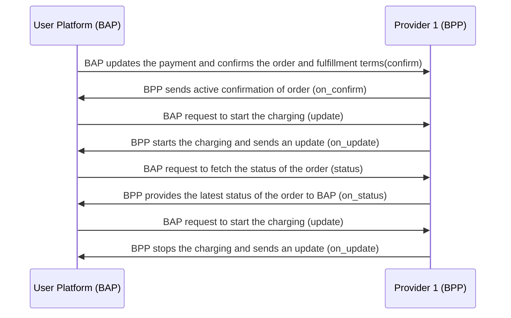

#### Example `confirm` api json:

```json
{
  "context": {
    "domain": "dent:0.1.0",
    "action": "confirm",
    "location": {
      "country": {
        "name": "India",
        "code": "IND"
      }
    },
    "city": "std:080",
    "version": "1.1.0",
    "bap_id": "example-bap.com",
    "bap_uri": "https://api.example-bap.com/pilot/bap/energy/v1",
    "bpp_id": "chargezone-energy-bpp.com",
    "bpp_uri": "https://api.example-bpp.com/pilot/bpp/",
    "transaction_id": "6743e9e2-4fb5-487c-92b7-13ba8018f176",
    "message_id": "6743e9e2-4fb5-487c-92b7-13ba8018f176",
    "timestamp": "2023-07-16T04:41:16Z"
  },
  "message": {
    "order": {
      "providers": {
        "id": "chargezone.in"
      },
      "items": [
        {
          "id": "pe-charging-01"
        }
      ],
      "billing": {
        "name": "John Doe",
        "email": "abc@example.com",
        "number": "+91-9876522222"
      },
      "fulfillments": [
        {
          "id": "1",
          "customer": {
            "person": {
              "name": "John Doe"
            },
            "contact": {
              "phone": "+91-9887766554"
            }
          }
        }
      ],
      "payments": [
        {
          "collected_by": "BPP",
          "params": {
            "amount": "40",
            "currency": "INR"
          },
          "status": "PAID",
          "type": "PRE-ORDER"
        }
      ],
      "quote": {
        "price": {
          "value": "40",
          "currency": "INR"
        },
        "breakup": [
          {
            "item": {
              "descriptor": {
                "name": "Estimated units consumed"
              },
              "quantity": {
                "selected": {
                  "measure": {
                    "value": "4",
                    "unit": "kWh"
                  }
                }
              }
            },
            "price": {
              "value": "32",
              "currency": "INR"
            }
          }
        ]
      }
    }
  }
}
```

#### Example `on_confirm` api json:

```json
{
  "context": {
    "domain": "dent:0.1.0",
    "action": "on_confirm",
    "location": {
      "country": {
        "name": "India",
        "code": "IND"
      }
    },
    "city": "std:080",
    "version": "1.1.0",
    "bap_id": "example-bap.com",
    "bap_uri": "https://api.example-bap.com/pilot/bap/energy/v1",
    "bpp_id": "example-bpp.com",
    "bpp_uri": "https://api.example-bpp.com/pilot/bpp/",
    "transaction_id": "6743e9e2-4fb5-487c-92b7-13ba8018f176",
    "message_id": "6743e9e2-4fb5-487c-92b7-13ba8018f176",
    "timestamp": "2023-07-16T04:41:16Z"
  },
  "message": {
    "order": {
      "id": "6743e9e2-4fb5-487c-92b7",
      "providers": {
        "id": "chargezone.in",
        "descriptor": {
          "name": "Chargezone",
          "short_desc": "Chargezone Technologies Pvt Ltd",
          "images": [
            {
              "url": "https://chargezone.in/images/logo.png"
            }
          ]
        }
      },
      "items": [
        {
          "id": "pe-charging-01",
          "descriptor": {
            "code": "energy"
          },
          "price": {
            "value": "8",
            "currency": "INR/kWH"
          },
          "quantity": {
            "available": {
              "measure": {
                "value": "100",
                "unit": "kWh"
              }
            },
            "selected": {
              "measure": {
                "value": "4",
                "unit": "kWh"
              }
            }
          },
          "fulfillments": ["1"]
        }
      ],
      "fulfillments": [
        {
          "id": "1",
          "customer": {
            "person": {
              "name": "John Doe"
            },
            "contact": {
              "phone": "+91-9887766554"
            }
          },
          "type": "CHARGING",
          "state": {
            "descriptor": {
              "code": "payment-completed"
            }
          },
          "stops": [
            {
              "type": "start",
              "location": {
                "gps": "12.423423,77.325647"
              },
              "time": {
                "timestamp": "01-06-2023 10:00:00",
                "range": {
                  "start": "01-06-2023 10:00:00",
                  "end": "01-06-2023 10:10:00"
                }
              },
              "instructions": {
                "name": "Charging instructions",
                "short_desc": "To start your charging, go to charger number 987, and click on 'start' on your app"
              }
            },
            {
              "type": "end",
              "time": {
                "timestamp": "01-06-2023 10:30:00",
                "range": {
                  "start": "01-06-2023 10:30:00",
                  "end": "01-06-2023 10:40:00"
                }
              }
            }
          ],
          "tags": [
            {
              "descriptor": {
                "name": "Charging Point"
              },
              "list": [
                {
                  "descriptor": {
                    "name": "Charger type"
                  },
                  "value": "AC"
                },
                {
                  "descriptor": {
                    "name": "Connector type"
                  },
                  "value": "CCS2"
                },
                {
                  "descriptor": {
                    "name": "Power Rating"
                  },
                  "value": "greater than 50kW"
                },
                {
                  "descriptor": {
                    "name": "Availability"
                  },
                  "value": "Available"
                }
              ],
              "display": true
            }
          ]
        }
      ],
      "billing": {
        "email": "abc@example.com",
        "number": "+91-9876522222"
      },
      "quote": {
        "price": {
          "value": "40",
          "currency": "INR"
        },
        "breakup": [
          {
            "item": {
              "descriptor": {
                "name": "Estimated units consumed"
              },
              "quantity": {
                "selected": {
                  "measure": {
                    "value": "4",
                    "unit": "kWh"
                  }
                }
              }
            },
            "price": {
              "value": "32",
              "currency": "INR"
            }
          }
        ]
      },
      "payments": [
        {
          "type": "PRE-ORDER",
          "status": "PAID",
          "params": {
            "amount": "40",
            "currency": "INR"
          },
          "time": {
            "range": {
              "start": "2023-08-10T10:00:00Z",
              "end": "2023-08-10T10:30:00Z"
            }
          }
        }
      ],
      "cancellation_terms": [
        {
          "fulfillment_state": {
            "descriptor": {
              "code": "charging-start"
            }
          },
          "cancellation_fee": {
            "percentage": "30%"
          },
          "external_ref": {
            "mimetype": "text/html",
            "url": "https://chargezone.in/charge/tnc.html"
          }
        }
      ]
    }
  }
}
```

#### Example `update` api json to start charging:

```json
{
  "context": {
    "domain": "dent:0.1.0",
    "action": "update",
    "location": {
      "country": {
        "name": "India",
        "code": "IND"
      }
    },
    "city": "std:080",
    "version": "1.1.0",
    "bap_id": "example-bap.com",
    "bap_uri": "https://api.example-bap.com/pilot/bap/energy/v1",
    "bpp_id": "chargezone-energy-bpp.com",
    "bpp_uri": "https://api.example-bpp.com/pilot/bpp/",
    "transaction_id": "6743e9e2-4fb5-487c-92b7-13ba8018f176",
    "message_id": "6743e9e2-4fb5-487c-92b7-13ba8018f176",
    "timestamp": "2023-07-16T04:41:16Z"
  },
  "message": {
    "update_target": "order.fulfillments[0].state",
    "order": {
      "fulfillments": [
        {
          "id": "1",
          "type": "CHARGING",
          "state": {
            "descriptor": {
              "code": "start-charging"
            }
          }
        }
      ]
    }
  }
}
```

#### Example `on_update` api json:

```json
{
  "context": {
    "domain": "dent:0.1.0",
    "action": "on_update",
    "location": {
      "country": {
        "name": "India",
        "code": "IND"
      }
    },
    "city": "std:080",
    "version": "1.1.0",
    "bap_id": "example-bap.com",
    "bap_uri": "https://api.example-bap.com/pilot/bap/energy/v1",
    "bpp_id": "example-bpp.com",
    "bpp_uri": "https://api.example-bpp.com/pilot/bpp/",
    "transaction_id": "6743e9e2-4fb5-487c-92b7-13ba8018f176",
    "message_id": "6743e9e2-4fb5-487c-92b7-13ba8018f176",
    "timestamp": "2023-07-16T04:41:16Z"
  },
  "message": {
    "order": {
      "id": "6743e9e2-4fb5-487c-92b7",
      "providers": {
        "id": "chargezone.in",
        "descriptor": {
          "name": "Chargezone",
          "short_desc": "Chargezone Technologies Pvt Ltd",
          "images": [
            {
              "url": "https://chargezone.in/images/logo.png"
            }
          ]
        }
      },
      "items": [
        {
          "id": "pe-charging-01",
          "descriptor": {
            "code": "energy"
          },
          "price": {
            "value": "8",
            "currency": "INR/kWH"
          },
          "quantity": {
            "available": {
              "measure": {
                "value": "100",
                "unit": "kWh"
              }
            },
            "selected": {
              "measure": {
                "value": "4",
                "unit": "kWh"
              }
            }
          },
          "fulfillments": ["1"]
        }
      ],
      "fulfillments": [
        {
          "id": "1",
          "customer": {
            "person": {
              "name": "John Doe"
            },
            "contact": {
              "phone": "+91-9887766554"
            }
          },
          "type": "CHARGING",
          "state": {
            "descriptor": {
              "code": "charging-started"
            }
          },
          "stops": [
            {
              "type": "start",
              "location": {
                "gps": "12.423423,77.325647"
              },
              "time": {
                "timestamp": "01-06-2023 10:00:00",
                "range": {
                  "start": "01-06-2023 10:00:00",
                  "end": "01-06-2023 10:10:00"
                }
              }
            },
            {
              "type": "end",
              "time": {
                "timestamp": "01-06-2023 10:30:00",
                "range": {
                  "start": "01-06-2023 10:30:00",
                  "end": "01-06-2023 10:40:00"
                }
              }
            }
          ],
          "tags": [
            {
              "descriptor": {
                "name": "Charging Point"
              },
              "list": [
                {
                  "descriptor": {
                    "name": "Charger type"
                  },
                  "value": "AC"
                },
                {
                  "descriptor": {
                    "name": "Connector type"
                  },
                  "value": "CCS2"
                },
                {
                  "descriptor": {
                    "name": "Power Rating"
                  },
                  "value": "greater than 50kW"
                },
                {
                  "descriptor": {
                    "name": "Availability"
                  },
                  "value": "Available"
                }
              ],
              "display": true
            }
          ]
        }
      ],
      "billing": {
        "email": "abc@example.com",
        "number": "+91-9876522222"
      },
      "quote": {
        "price": {
          "value": "40",
          "currency": "INR"
        },
        "breakup": [
          {
            "item": {
              "descriptor": {
                "name": "Estimated units consumed"
              },
              "quantity": {
                "selected": {
                  "measure": {
                    "value": "4",
                    "unit": "kWh"
                  }
                }
              }
            },
            "price": {
              "value": "32",
              "currency": "INR"
            }
          }
        ]
      },
      "payments": [
        {
          "type": "PRE-ORDER",
          "status": "PAID",
          "params": {
            "amount": "40",
            "currency": "INR"
          },
          "time": {
            "range": {
              "start": "2023-08-10T10:00:00Z",
              "end": "2023-08-10T10:30:00Z"
            }
          }
        }
      ],
      "cancellation_terms": [
        {
          "fulfillment_state": {
            "descriptor": {
              "code": "charging-start"
            }
          },
          "cancellation_fee": {
            "percentage": "30%"
          },
          "external_ref": {
            "mimetype": "text/html",
            "url": "https://chargezone.in/charge/tnc.html"
          }
        }
      ]
    }
  }
}
```

#### Example `update` api json to stop charging:

```json
{
  "context": {
    "domain": "dent:0.1.0",
    "action": "update",
    "location": {
      "country": {
        "name": "India",
        "code": "IND"
      }
    },
    "city": "std:080",
    "version": "1.1.0",
    "bap_id": "example-bap.com",
    "bap_uri": "https://api.example-bap.com/pilot/bap/energy/v1",
    "bpp_id": "chargezone-energy-bpp.com",
    "bpp_uri": "https://api.example-bpp.com/pilot/bpp/",
    "transaction_id": "6743e9e2-4fb5-487c-92b7-13ba8018f176",
    "message_id": "6743e9e2-4fb5-487c-92b7-13ba8018f176",
    "timestamp": "2023-07-16T04:41:16Z"
  },
  "message": {
    "update_target": "order.fulfillments[0].state",
    "order": {
      "fulfillments": [
        {
          "id": "1",
          "state": {
            "descriptor": {
              "code": "end-charging"
            }
          }
        }
      ]
    }
  }
}
```

#### Example `on_update` api json:

```json
{
  "context": {
    "domain": "dent:0.1.0",
    "action": "on_update",
    "location": {
      "country": {
        "name": "India",
        "code": "IND"
      }
    },
    "city": "std:080",
    "version": "1.1.0",
    "bap_id": "example-bap.com",
    "bap_uri": "https://api.example-bap.com/pilot/bap/energy/v1",
    "bpp_id": "example-bpp.com",
    "bpp_uri": "https://api.example-bpp.com/pilot/bpp/",
    "transaction_id": "6743e9e2-4fb5-487c-92b7-13ba8018f176",
    "message_id": "6743e9e2-4fb5-487c-92b7-13ba8018f176",
    "timestamp": "2023-07-16T04:41:16Z"
  },
  "message": {
    "order": {
      "id": "6743e9e2-4fb5-487c-92b7",
      "providers": {
        "id": "chargezone.in",
        "descriptor": {
          "name": "Chargezone",
          "short_desc": "Chargezone Technologies Pvt Ltd",
          "images": [
            {
              "url": "https://chargezone.in/images/logo.png"
            }
          ]
        }
      },
      "items": [
        {
          "id": "pe-charging-01",
          "descriptor": {
            "code": "energy"
          },
          "price": {
            "value": "8",
            "currency": "INR/kWH"
          },
          "quantity": {
            "available": {
              "measure": {
                "value": "100",
                "unit": "kWh"
              }
            },
            "selected": {
              "measure": {
                "value": "4",
                "unit": "kWh"
              }
            }
          },
          "fulfillments": ["1"]
        }
      ],
      "fulfillments": [
        {
          "id": "1",
          "customer": {
            "person": {
              "name": "John Doe"
            },
            "contact": {
              "phone": "+91-9887766554"
            }
          },
          "type": "CHARGING",
          "state": {
            "descriptor": {
              "code": "charging-ended"
            }
          },
          "stops": [
            {
              "type": "start",
              "location": {
                "gps": "12.423423,77.325647"
              },
              "time": {
                "timestamp": "01-06-2023 10:00:00",
                "range": {
                  "start": "01-06-2023 10:00:00",
                  "end": "01-06-2023 10:10:00"
                }
              }
            },
            {
              "type": "end",
              "time": {
                "timestamp": "01-06-2023 10:30:00",
                "range": {
                  "start": "01-06-2023 10:30:00",
                  "end": "01-06-2023 10:40:00"
                }
              }
            }
          ],
          "tags": [
            {
              "descriptor": {
                "name": "Charging Point"
              },
              "list": [
                {
                  "descriptor": {
                    "name": "Charger type"
                  },
                  "value": "AC"
                },
                {
                  "descriptor": {
                    "name": "Connector type"
                  },
                  "value": "CCS2"
                },
                {
                  "descriptor": {
                    "name": "Power Rating"
                  },
                  "value": "greater than 50kW"
                },
                {
                  "descriptor": {
                    "name": "Availability"
                  },
                  "value": "Available"
                }
              ],
              "display": true
            }
          ]
        }
      ],
      "billing": {
        "email": "abc@example.com",
        "number": "+91-9876522222"
      },
      "quote": {
        "price": {
          "value": "40",
          "currency": "INR"
        },
        "breakup": [
          {
            "item": {
              "descriptor": {
                "name": "Estimated units consumed"
              },
              "quantity": {
                "selected": {
                  "measure": {
                    "value": "4",
                    "unit": "kWh"
                  }
                }
              }
            },
            "price": {
              "value": "32",
              "currency": "INR"
            }
          }
        ]
      },
      "payments": [
        {
          "type": "PRE-ORDER",
          "status": "PAID",
          "params": {
            "amount": "40",
            "currency": "INR"
          },
          "time": {
            "range": {
              "start": "2023-08-10T10:00:00Z",
              "end": "2023-08-10T10:30:00Z"
            }
          }
        }
      ],
      "cancellation_terms": [
        {
          "fulfillment_state": {
            "descriptor": {
              "code": "charging-start"
            }
          },
          "cancellation_fee": {
            "percentage": "30%"
          },
          "external_ref": {
            "mimetype": "text/html",
            "url": "https://chargezone.in/charge/tnc.html"
          }
        }
      ]
    }
  }
}
```

#### Example `status` api json:

```json
{
  "context": {
    "domain": "dent:0.1.0",
    "action": "status",
    "location": {
      "country": {
        "name": "India",
        "code": "IND"
      }
    },
    "city": "std:080",
    "version": "1.1.0",
    "bap_id": "example-bap.com",
    "bap_uri": "https://api.example-bap.com/pilot/bap/energy/v1",
    "bpp_id": "chargezone-energy-bpp.com",
    "bpp_uri": "https://api.example-bpp.com/pilot/bpp/",
    "transaction_id": "6743e9e2-4fb5-487c-92b7-13ba8018f176",
    "message_id": "6743e9e2-4fb5-487c-92b7-13ba8018f176",
    "timestamp": "2023-07-16T04:41:16Z"
  },
  "message": {
    "order_id": "6743e9e2-4fb5-487c-92b7"
  }
}
```

#### Example `on_status` api json:

```json
{
  "context": {
    "domain": "dent:0.1.0",
    "action": "on_status",
    "location": {
      "country": {
        "name": "India",
        "code": "IND"
      }
    },
    "city": "std:080",
    "version": "1.1.0",
    "bap_id": "example-bap.com",
    "bap_uri": "https://api.example-bap.com/pilot/bap/energy/v1",
    "bpp_id": "example-bpp.com",
    "bpp_uri": "https://api.example-bpp.com/pilot/bpp/",
    "transaction_id": "6743e9e2-4fb5-487c-92b7-13ba8018f176",
    "message_id": "6743e9e2-4fb5-487c-92b7-13ba8018f176",
    "timestamp": "2023-07-16T04:41:16Z"
  },
  "message": {
    "order": {
      "id": "6743e9e2-4fb5-487c-92b7",
      "providers": {
        "id": "chargezone.in",
        "descriptor": {
          "name": "Chargezone",
          "short_desc": "Chargezone Technologies Pvt Ltd",
          "images": [
            {
              "url": "https://chargezone.in/images/logo.png"
            }
          ]
        }
      },
      "items": [
        {
          "id": "pe-charging-01",
          "descriptor": {
            "code": "energy"
          },
          "price": {
            "value": "8",
            "currency": "INR/kWH"
          },
          "quantity": {
            "available": {
              "measure": {
                "value": "100",
                "unit": "kWh"
              }
            },
            "selected": {
              "measure": {
                "value": "4",
                "unit": "kWh"
              }
            }
          },
          "fulfillments": ["1"]
        }
      ],
      "fulfillments": [
        {
          "id": "1",
          "customer": {
            "person": {
              "name": "John Doe"
            },
            "contact": {
              "phone": "+91-9887766554"
            }
          },
          "type": "CHARGING",
          "state": {
            "descriptor": {
              "name": "vehicle 65% charged"
            }
          },
          "stops": [
            {
              "type": "start",
              "location": {
                "gps": "12.423423,77.325647"
              },
              "time": {
                "timestamp": "01-06-2023 10:00:00",
                "range": {
                  "start": "01-06-2023 10:00:00",
                  "end": "01-06-2023 10:10:00"
                }
              }
            },
            {
              "type": "end",
              "time": {
                "timestamp": "01-06-2023 10:30:00",
                "range": {
                  "start": "01-06-2023 10:30:00",
                  "end": "01-06-2023 10:40:00"
                }
              }
            }
          ],
          "tags": [
            {
              "descriptor": {
                "name": "Charging Point"
              },
              "list": [
                {
                  "descriptor": {
                    "name": "Charger type"
                  },
                  "value": "AC"
                },
                {
                  "descriptor": {
                    "name": "Connector type"
                  },
                  "value": "CCS2"
                },
                {
                  "descriptor": {
                    "name": "Power Rating"
                  },
                  "value": "greater than 50kW"
                },
                {
                  "descriptor": {
                    "name": "Availability"
                  },
                  "value": "Available"
                }
              ],
              "display": true
            }
          ]
        }
      ],
      "billing": {
        "email": "abc@example.com",
        "number": "+91-9876522222"
      },
      "quote": {
        "price": {
          "value": "32",
          "currency": "INR"
        },
        "breakup": [
          {
            "item": {
              "descriptor": {
                "name": "Estimated units consumed"
              },
              "quantity": {
                "selected": {
                  "measure": {
                    "value": "4",
                    "unit": "kWh"
                  }
                }
              }
            },
            "price": {
              "value": "32",
              "currency": "INR"
            }
          }
        ]
      },
      "payments": [
        {
          "type": "PRE-ORDER",
          "status": "PAID",
          "params": {
            "amount": "40",
            "currency": "INR"
          },
          "time": {
            "range": {
              "start": "2023-08-10T10:00:00Z",
              "end": "2023-08-10T10:30:00Z"
            }
          }
        }
      ],
      "cancellation_terms": [
        {
          "fulfillment_state": {
            "descriptor": {
              "code": "charging-start"
            }
          },
          "cancellation_fee": {
            "percentage": "30%"
          },
          "external_ref": {
            "mimetype": "text/html",
            "url": "https://chargezone.in/charge/tnc.html"
          }
        }
      ]
    }
  }
}
```

#### Example `cancel` api json:

```json
{
  "context": {
    "domain": "dent:0.1.0",
    "action": "cancel",
    "location": {
      "country": {
        "name": "India",
        "code": "IND"
      }
    },
    "city": "std:080",
    "version": "1.1.0",
    "bap_id": "example-bap.com",
    "bap_uri": "https://api.example-bap.com/pilot/bap/energy/v1",
    "bpp_id": "chargezone-energy-bpp.com",
    "bpp_uri": "https://api.example-bpp.com/pilot/bpp/",
    "transaction_id": "6743e9e2-4fb5-487c-92b7-13ba8018f176",
    "message_id": "6743e9e2-4fb5-487c-92b7-13ba8018f176",
    "timestamp": "2023-07-16T04:41:16Z"
  },
  "message": {
    "order": {
      "cancellation_reason_id": "5",
      "descriptor": {
        "short_desc": "Can't make it on time"
      },
      "order_id": "6743e9e2-4fb5-487c-92b7"
    }
  }
}
```

#### Example `on_cancel` api json:

```json
{
  "context": {
    "domain": "dent:0.1.0",
    "action": "on_cancel",
    "location": {
      "country": {
        "name": "India",
        "code": "IND"
      }
    },
    "city": "std:080",
    "version": "1.1.0",
    "bap_id": "example-bap.com",
    "bap_uri": "https://api.example-bap.com/pilot/bap/energy/v1",
    "bpp_id": "example-bpp.com",
    "bpp_uri": "https://api.example-bpp.com/pilot/bpp/",
    "transaction_id": "6743e9e2-4fb5-487c-92b7-13ba8018f176",
    "message_id": "6743e9e2-4fb5-487c-92b7-13ba8018f176",
    "timestamp": "2023-07-16T04:41:16Z"
  },
  "message": {
    "order": {
      "id": "6743e9e2-4fb5-487c-92b7",
      "status": "CANCELLED",
      "providers": {
        "id": "chargezone.in",
        "descriptor": {
          "name": "Chargezone",
          "short_desc": "Chargezone Technologies Pvt Ltd",
          "images": [
            {
              "url": "https://chargezone.in/images/logo.png"
            }
          ]
        }
      },
      "items": [
        {
          "id": "pe-charging-01",
          "descriptor": {
            "code": "energy"
          },
          "price": {
            "value": "8",
            "currency": "INR/kWH"
          },
          "quantity": {
            "available": {
              "measure": {
                "value": "100",
                "unit": "kWh"
              }
            },
            "selected": {
              "measure": {
                "value": "4",
                "unit": "kWh"
              }
            }
          },
          "fulfillments": ["1"]
        }
      ],
      "fulfillments": [
        {
          "id": "1",
          "customer": {
            "person": {
              "name": "John Doe"
            },
            "contact": {
              "phone": "+91-9887766554"
            }
          },
          "type": "CHARGING",
          "state": {
            "descriptor": {
              "code": "order-cancelled"
            }
          },
          "stops": [
            {
              "time": {
                "range": {
                  "start": "10:00",
                  "end": "10:30"
                }
              }
            }
          ],
          "tags": [
            {
              "descriptor": {
                "name": "Charging Point"
              },
              "list": [
                {
                  "descriptor": {
                    "name": "Charger type"
                  },
                  "value": "AC"
                },
                {
                  "descriptor": {
                    "name": "Connector type"
                  },
                  "value": "CCS2"
                },
                {
                  "descriptor": {
                    "name": "Power Rating"
                  },
                  "value": "greater than 50kW"
                },
                {
                  "descriptor": {
                    "name": "Availability"
                  },
                  "value": "Available"
                }
              ],
              "display": true
            }
          ]
        }
      ],
      "billing": {
        "email": "abc@example.com",
        "number": "+91-9876522222"
      },
      "quote": {
        "price": {
          "value": "40",
          "currency": "INR"
        },
        "breakup": [
          {
            "item": {
              "descriptor": {
                "name": "Estimated units consumed"
              },
              "quantity": {
                "selected": {
                  "measure": {
                    "value": "4",
                    "unit": "kWh"
                  }
                }
              }
            },
            "price": {
              "value": "32",
              "currency": "INR"
            }
          }
        ]
      },
      "payments": [
        {
          "type": "PRE-ORDER",
          "status": "PAID",
          "params": {
            "amount": "40",
            "currency": "INR"
          },
          "time": {
            "range": {
              "start": "2023-08-10T10:00:00Z",
              "end": "2023-08-10T10:30:00Z"
            }
          }
        }
      ]
    }
  }
}
```

#### example for `support` call

```json
{
  "context": {
    "domain": "dent:0.1.0",
    "action": "support",
    "location": {
      "country": {
        "name": "India",
        "code": "IND"
      }
    },
    "city": "std:080",
    "version": "1.1.0",
    "bap_id": "example-bap.com",
    "bap_uri": "https://api.example-bap.com/pilot/bap/energy/v1",
    "bpp_id": "chargezone-energy-bpp.com",
    "bpp_uri": "https://api.example-bpp.com/pilot/bpp/",
    "transaction_id": "6743e9e2-4fb5-487c-92b7-13ba8018f176",
    "message_id": "6743e9e2-4fb5-487c-92b7-13ba8018f176",
    "timestamp": "2023-07-16T04:41:16Z"
  },
  "message": {
    "support": {
      "order_id": "6743e9e2-4fb5-487c-92b7",
      "phone": "+919876543210",
      "email": "john.doe@gmail.com"
    }
  }
}
```

#### example for `on_support` call

```json
{
  "context": {
    "domain": "dent:0.1.0",
    "action": "on_support",
    "location": {
      "country": {
        "name": "India",
        "code": "IND"
      }
    },
    "city": "std:080",
    "version": "1.1.0",
    "bap_id": "example-bap.com",
    "bap_uri": "https://api.example-bap.com/pilot/bap/energy/v1",
    "bpp_id": "chargezone-energy-bpp.com",
    "bpp_uri": "https://api.example-bpp.com/pilot/bpp/",
    "transaction_id": "6743e9e2-4fb5-487c-92b7-13ba8018f176",
    "message_id": "6743e9e2-4fb5-487c-92b7-13ba8018f176",
    "timestamp": "2023-07-16T04:41:16Z"
  },
  "message": {
    "support": {
      "order_id": "6743e9e2-4fb5-487c-92b7",
      "phone": "1800 1080",
      "email": "customer.care@chargezone.com",
      "url": "https://www.chargezone.com/helpdesk"
    }
  }
}
```

## Order cancel

### User-side Actions

- Request to cancel the order

#### Provider-side Actions

- Cancels the order of the BAP

### Logical Worklow

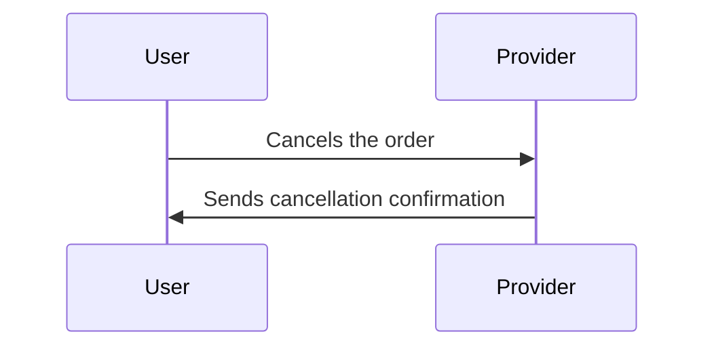

### Beckn API Workflow

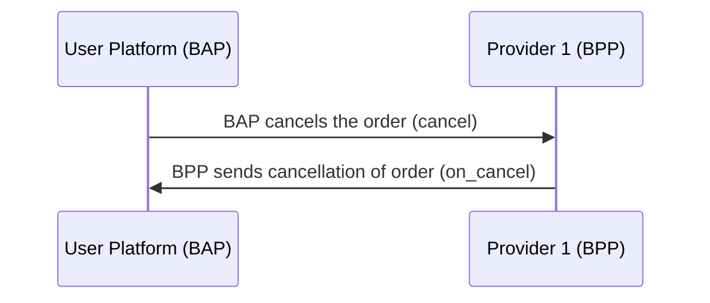

#### example `cancel` JSON

```json
{
  "context": {
    "domain": "dent:0.1.0",
    "action": "cancel",
    "location": {
      "country": {
        "name": "India",
        "code": "IND"
      }
    },
    "city": "std:080",
    "version": "1.1.0",
    "bap_id": "example-bap.com",
    "bap_uri": "https://api.example-bap.com/pilot/bap/energy/v1",
    "bpp_id": "chargezone-energy-bpp.com",
    "bpp_uri": "https://api.example-bpp.com/pilot/bpp/",
    "transaction_id": "6743e9e2-4fb5-487c-92b7-13ba8018f176",
    "message_id": "6743e9e2-4fb5-487c-92b7-13ba8018f176",
    "timestamp": "2023-07-16T04:41:16Z"
  },
  "message": {
    "order": {
      "cancellation_reason_id": "5",
      "descriptor": {
        "short_desc": "can't attend booking"
      },
      "order_id": "6743e9e2-4fb5-487c-92b7"
    }
  }
}
```

#### example `on_cancel` JSON

```json
{
  "context": {
    "domain": "dent:0.1.0",
    "action": "on_cancel",
    "location": {
      "country": {
        "name": "India",
        "code": "IND"
      }
    },
    "city": "std:080",
    "version": "1.1.0",
    "bap_id": "example-bap.com",
    "bap_uri": "https://api.example-bap.com/pilot/bap/energy/v1",
    "bpp_id": "example-bpp.com",
    "bpp_uri": "https://api.example-bpp.com/pilot/bpp/",
    "transaction_id": "6743e9e2-4fb5-487c-92b7-13ba8018f176",
    "message_id": "6743e9e2-4fb5-487c-92b7-13ba8018f176",
    "timestamp": "2023-07-16T04:41:16Z"
  },
  "message": {
    "order": {
      "id": "6743e9e2-4fb5-487c-92b7",
      "status": "CANCELLED",
      "providers": {
        "id": "chargezone.in",
        "descriptor": {
          "name": "Chargezone",
          "short_desc": "Chargezone Technologies Pvt Ltd",
          "images": [
            {
              "url": "https://chargezone.in/images/logo.png"
            }
          ]
        }
      },
      "items": [
        {
          "id": "pe-charging-01",
          "descriptor": {
            "code": "energy"
          },
          "price": {
            "value": "8",
            "currency": "INR/kWH"
          },
          "quantity": {
            "available": {
              "measure": {
                "value": "100",
                "unit": "kWh"
              }
            },
            "selected": {
              "measure": {
                "value": "4",
                "unit": "kWh"
              }
            }
          },
          "fulfillments": ["1"]
        }
      ],
      "fulfillments": [
        {
          "id": "1",
          "customer": {
            "person": {
              "name": "John Doe"
            },
            "contact": {
              "phone": "+91-9887766554"
            }
          },
          "type": "CHARGING",
          "state": {
            "descriptor": {
              "code": "order-cancelled"
            }
          },
          "stops": [
            {
              "time": {
                "range": {
                  "start": "10:00",
                  "end": "10:30"
                }
              }
            }
          ],
          "tags": [
            {
              "descriptor": {
                "name": "Charging Point"
              },
              "list": [
                {
                  "descriptor": {
                    "name": "Charger type"
                  },
                  "value": "AC"
                },
                {
                  "descriptor": {
                    "name": "Connector type"
                  },
                  "value": "CCS2"
                },
                {
                  "descriptor": {
                    "name": "Power Rating"
                  },
                  "value": "greater than 50kW"
                },
                {
                  "descriptor": {
                    "name": "Availability"
                  },
                  "value": "Available"
                }
              ],
              "display": true
            }
          ]
        }
      ],
      "billing": {
        "email": "abc@example.com",
        "number": "+91-9876522222"
      },
      "quote": {
        "price": {
          "value": "-32",
          "currency": "INR"
        },
        "breakup": [
          {
            "item": {
              "descriptor": {
                "name": "payment refund"
              },
              "quantity": {
                "selected": {
                  "measure": {
                    "value": "4",
                    "unit": "kWh"
                  }
                }
              }
            },
            "price": {
              "value": "-32",
              "currency": "INR"
            }
          }
        ]
      },
      "payments": [
        {
          "type": "PRE-ORDER",
          "status": "PAID",
          "params": {
            "amount": "40",
            "currency": "INR"
          },
          "time": {
            "range": {
              "start": "2023-08-10T10:00:00Z",
              "end": "2023-08-10T10:30:00Z"
            }
          }
        }
      ],
      "cancellation_terms": [
        {
          "fulfillment_state": {
            "descriptor": {
              "code": "charging-start"
            }
          },
          "cancellation_fee": {
            "percentage": "30%"
          },
          "external_ref": {
            "mimetype": "text/html",
            "url": "https://chargezone.in/charge/tnc.html"
          }
        }
      ]
    }
  }
}
```

#### example `on_cancel` JSON triggered by BPP

```json
{
  "context": {
    "domain": "dent:0.1.0",
    "action": "on_cancel",
    "location": {
      "country": {
        "name": "India",
        "code": "IND"
      }
    },
    "city": "std:080",
    "version": "1.1.0",
    "bap_id": "example-bap.com",
    "bap_uri": "https://api.example-bap.com/pilot/bap/energy/v1",
    "bpp_id": "example-bpp.com",
    "bpp_uri": "https://api.example-bpp.com/pilot/bpp/",
    "transaction_id": "6743e9e2-4fb5-487c-92b7-13ba8018f176",
    "message_id": "6743e9e2-4fb5-487c-92b7-13ba8018f176",
    "timestamp": "2023-07-16T04:41:16Z"
  },
  "message": {
    "order": {
      "id": "6743e9e2-4fb5-487c-92b7",
      "status": "CANCELLED",
      "providers": {
        "id": "chargezone.in",
        "descriptor": {
          "name": "Chargezone",
          "short_desc": "Chargezone Technologies Pvt Ltd",
          "images": [
            {
              "url": "https://chargezone.in/images/logo.png"
            }
          ]
        }
      },
      "items": [
        {
          "id": "pe-charging-01",
          "descriptor": {
            "code": "energy"
          },
          "price": {
            "value": "8",
            "currency": "INR/kWH"
          },
          "quantity": {
            "available": {
              "measure": {
                "value": "100",
                "unit": "kWh"
              }
            },
            "selected": {
              "measure": {
                "value": "4",
                "unit": "kWh"
              }
            },
            "allocated": {
              "measure": {
                "value": "2",
                "unit": "kWh"
              }
            }
          },
          "fulfillments": ["1"]
        }
      ],
      "fulfillments": [
        {
          "id": "1",
          "customer": {
            "person": {
              "name": "John Doe"
            },
            "contact": {
              "phone": "+91-9887766554"
            }
          },
          "type": "CHARGING",
          "state": {
            "descriptor": {
              "code": "charger-error"
            }
          },
          "stops": [
            {
              "time": {
                "range": {
                  "start": "10:00",
                  "end": "10:30"
                }
              }
            }
          ],
          "tags": [
            {
              "descriptor": {
                "name": "Charging Point"
              },
              "list": [
                {
                  "descriptor": {
                    "name": "Charger type"
                  },
                  "value": "AC"
                },
                {
                  "descriptor": {
                    "name": "Connector type"
                  },
                  "value": "CCS2"
                },
                {
                  "descriptor": {
                    "name": "Power Rating"
                  },
                  "value": "greater than 50kW"
                },
                {
                  "descriptor": {
                    "name": "Availability"
                  },
                  "value": "Available"
                }
              ],
              "display": true
            }
          ]
        }
      ],
      "billing": {
        "email": "abc@example.com",
        "number": "+91-9876522222"
      },
      "quote": {
        "price": {
          "value": "-12",
          "currency": "INR"
        },
        "breakup": [
          {
            "item": {
              "descriptor": {
                "name": "payment refund"
              },
              "quantity": {
                "selected": {
                  "measure": {
                    "value": "4",
                    "unit": "kWh"
                  }
                }
              }
            },
            "price": {
              "value": "-12",
              "currency": "INR"
            }
          }
        ]
      },
      "payments": [
        {
          "type": "PRE-ORDER",
          "status": "PAID",
          "params": {
            "amount": "40",
            "currency": "INR"
          },
          "time": {
            "range": {
              "start": "2023-08-10T10:00:00Z",
              "end": "2023-08-10T10:30:00Z"
            }
          }
        }
      ],
      "cancellation_terms": [
        {
          "fulfillment_state": {
            "descriptor": {
              "code": "charging-start"
            }
          },
          "cancellation_fee": {
            "percentage": "30%"
          },
          "external_ref": {
            "mimetype": "text/html",
            "url": "https://chargezone.in/charge/tnc.html"
          }
        }
      ]
    }
  }
}
```

## Order rating

### User-side Actions

- Request to rate the order

#### Provider-side Actions

- Rates the order of the BAP

### Logical Worklow

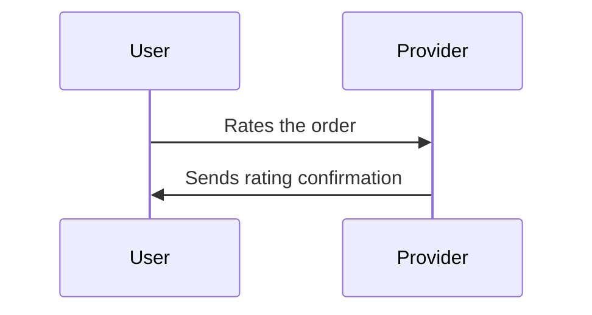

### Beckn API Workflow

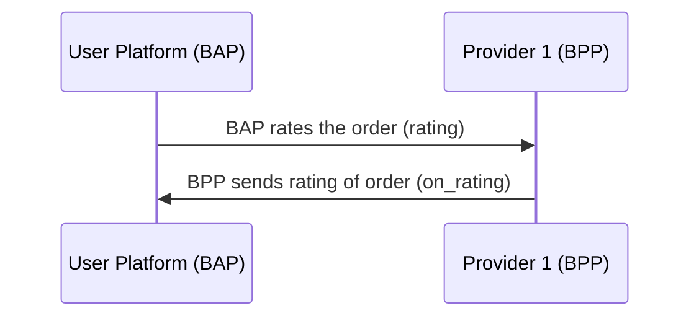

#### example `rating` JSON

```json
{
  "context": {
    "domain": "dent:0.1.0",
    "action": "rating",
    "location": {
      "country": {
        "name": "India",
        "code": "IND"
      }
    },
    "city": "std:080",
    "version": "1.1.0",
    "bap_id": "example-bap.com",
    "bap_uri": "https://api.example-bap.com/pilot/bap/energy/v1",
    "bpp_id": "chargezone-energy-bpp.com",
    "bpp_uri": "https://api.example-bpp.com/pilot/bpp/",
    "transaction_id": "6743e9e2-4fb5-487c-92b7-13ba8018f176",
    "message_id": "6743e9e2-4fb5-487c-92b7-13ba8018f176",
    "timestamp": "2023-07-16T04:41:16Z"
  },
  "message": {
    "ratings": [
      {
        "id": "6743e9e2-4fb5-487c-92b7",
        "rating_category": "charger",
        "value": "5"
      }
    ]
  }
}
```

#### example `on_rating` JSON

```json
{
  "context": {
    "domain": "dent:0.1.0",
    "action": "on_rating",
    "location": {
      "country": {
        "name": "India",
        "code": "IND"
      }
    },
    "city": "std:080",
    "version": "1.1.0",
    "bap_id": "example-bap.com",
    "bap_uri": "https://api.example-bap.com/pilot/bap/energy/v1",
    "bpp_id": "chargezone-energy-bpp.com",
    "bpp_uri": "https://api.example-bpp.com/pilot/bpp/",
    "transaction_id": "6743e9e2-4fb5-487c-92b7-13ba8018f176",
    "message_id": "6743e9e2-4fb5-487c-92b7-13ba8018f176",
    "timestamp": "2023-07-16T04:41:16Z"
  },
  "message": {
    "feedback_form": {
      "xinput": {
        "form": {
          "url": "https://api.example-bpp.com/pilot/bpp/feedback/portal"
        },
        "required": "false"
      }
    }
  }
}
```

## Order support

### User-side Actions

- Request to get support for the order

#### Provider-side Actions

- Provides support to the BAP

### Logical Worklow

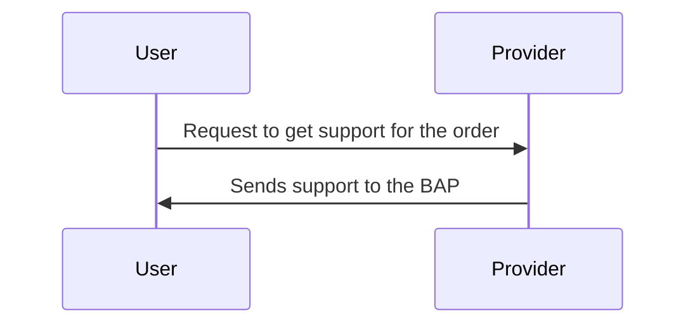

### Beckn API Workflow

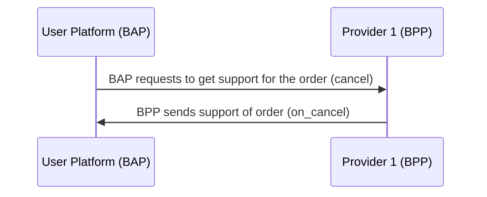

#### example `support` JSON

```json
{
  "context": {
    "domain": "dent:0.1.0",
    "action": "support",
    "location": {
      "country": {
        "name": "India",
        "code": "IND"
      }
    },
    "city": "std:080",
    "version": "1.1.0",
    "bap_id": "example-bap.com",
    "bap_uri": "https://api.example-bap.com/pilot/bap/energy/v1",
    "bpp_id": "chargezone-energy-bpp.com",
    "bpp_uri": "https://api.example-bpp.com/pilot/bpp/",
    "transaction_id": "6743e9e2-4fb5-487c-92b7-13ba8018f176",
    "message_id": "6743e9e2-4fb5-487c-92b7-13ba8018f176",
    "timestamp": "2023-07-16T04:41:16Z"
  },
  "message": {
    "support": {
      "order_id": "6743e9e2-4fb5-487c-92b7",
      "phone": "+919876543210",
      "email": "john.doe@gmail.com"
    }
  }
}
```

#### example `on_support` JSON

```json
{
  "context": {
    "domain": "dent:0.1.0",
    "action": "on_support",
    "location": {
      "country": {
        "name": "India",
        "code": "IND"
      }
    },
    "city": "std:080",
    "version": "1.1.0",
    "bap_id": "example-bap.com",
    "bap_uri": "https://api.example-bap.com/pilot/bap/energy/v1",
    "bpp_id": "chargezone-energy-bpp.com",
    "bpp_uri": "https://api.example-bpp.com/pilot/bpp/",
    "transaction_id": "6743e9e2-4fb5-487c-92b7-13ba8018f176",
    "message_id": "6743e9e2-4fb5-487c-92b7-13ba8018f176",
    "timestamp": "2023-07-16T04:41:16Z"
  },
  "message": {
    "support": {
      "order_id": "6743e9e2-4fb5-487c-92b7",
      "phone": "1800 1080",
      "email": "customer.care@chargezone.com",
      "url": "https://www.chargezone.com/helpdesk"
    }
  }
}
```
