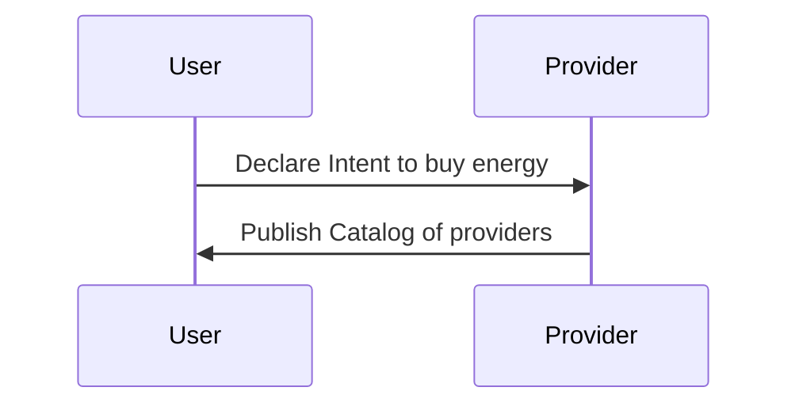
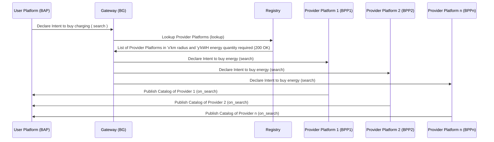
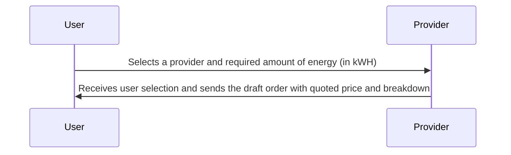
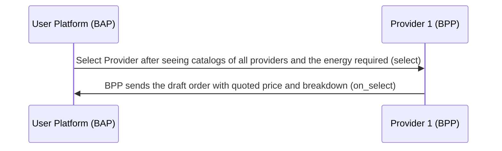
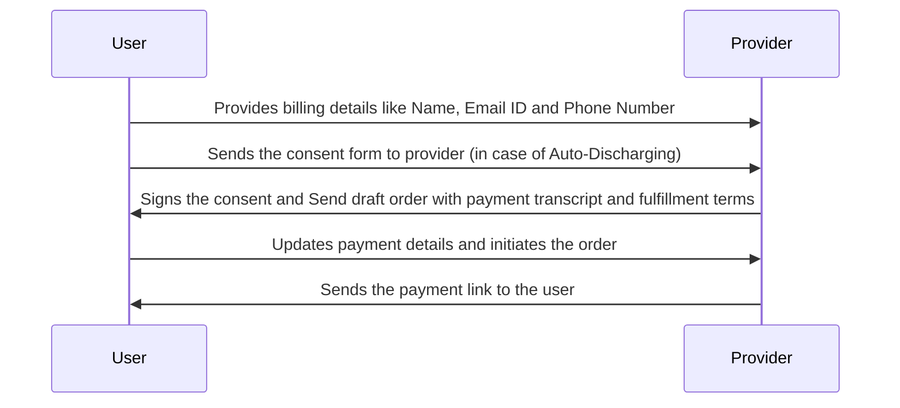
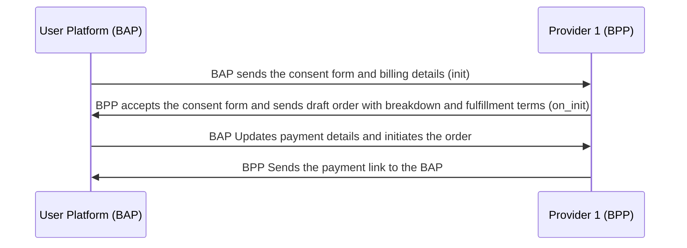
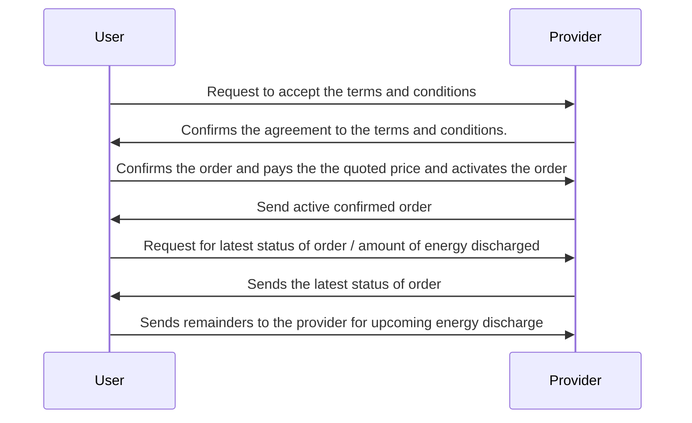
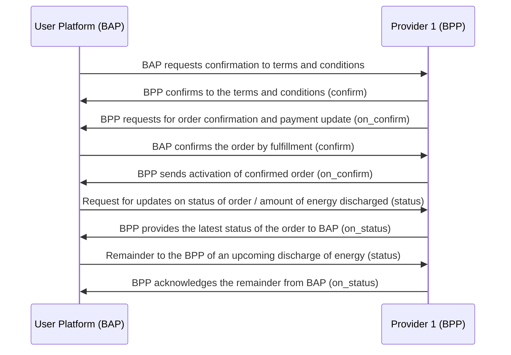

# General Energy Transaction Workflow #1

## Overview

This implementation guide outlines the energy transaction process where Sheru (Energy Aggregator) purchases energy from individuals or crowds using the Beckn Protocol. The guide provides step-by-step instructions on how Sheru interacts with the Unified Energy Interface (UEI) to discover energy sources, select providers, initiate transactions, confirm orders, and monitor status updates.

## Important NOTE :

- During Auto-Discharge, the provider will sign a consent form such that upon the initiation of the energy transaction, access to discharging/dischargeing the energy from the battery or source of energy is completely given to UEI, until the transaction is completed.
- Since, only UEI has the control/access to discharge the battery or energy source, there is no need of penalty.
- During Manual Discharge, the control/access are not given to UEI; rather, the provider him/herself will discharge/discharge the energy.
- In this case, if the provider has not satisfied the terms he/she agreed upon during the transaction, then the provider has to pay the penalty for the amount of energy he/she was not able to provide.
- The form of energy discharging, either through Auto-Discharging or Manual-Discharging is completely the provider's choice, which is a `pre-select` feature for the provider.

Bear in mind that this is just an example workflow for a simple Energy transaction where Sheru buys the Energy from the individuals/crowd using UEI.

(Note: Here, User -> Sheru and Provider -> Individual/Crowd who is providing energy and UEI -> Unified Energy Interface)

A typical workflow for EV Charging & Battery Swapping consists of the following steps:

#### Step 1: Discovery of Electricity

- The user searches providers who agree to Auto-Discharge or else Manual-Discharge (which will act as a filter for search)
  1.  Automatic discharge
      - Complete control of discharge is given to the UEI.
  2.  Manual Discharge
      - Commit to providing the required energy; penalties for non-compliance are applicable.
- The user searches for providers who provides the greater than equal to amount of energy needed in kWH (which will act as a filter for the search).

#### Step 2: Provider platform sends catalogs of Individuals nearby

The UEI sends all the catalogs to the user.
The list of catalogs consists of:

- Individuals/Crowds from whom energy can be bought (Name, Phone Number, Email ID)
- Mode of Energy discharge provider has agreed upon (i.e, Automatic discharge / Manual Discharge)
- Available areas/locations for energy purchases
- Available amount of energy (in kWH)
- Tariff per unit (in INR/kWH)

#### Step 3: Sheru selects a Provider

The user selects a suitable individual/crowd provider from the list of provided catalogs, from either Automatic Discharge or else Manual Discharge
The user selects the required amount of energy (in kWH)
The UEI notifies the chosen individual that Sheru intends to buy energy

#### Step 4: Provider sends the draft order with quoted price

The provider acknowledges the notification sent by UEI for selling energy
The provider will receive the order based on the user's requirements. The user gets the quoted price, including the breakdown of the price details. The breakdown should include:

1.  Tariff per unit (i.e., INR/kWH), might change based on location of Energy Provider
2.  Amount of energy requested (in kWH)
3.  Price for energy (in INR) : (Amount of energy requested) x (Tariff per unit)
4.  Taxes: CGST & SGST

#### Step 5: Initiating the transaction

The user initializes the order by providing the billing details such as (Name, Phone Number, Email ID)
The UEI requests the provider to accept the consent form (i.e., a check box) to take control/access to discharging the battery/energy source during Auto Discharge (in the case of Auto-Discharge Providers)

#### Step 6: Provider sends draft order

[In case of Auto-discharge.] The provider signs the consent letter (i.e., ticks the check box), that implies the provider is giving control to UEI for discharging their battery or energy source.
The provider sends the draft order with the payment link and fulfillment terms to the user's side.
A payment link is sent to user to complete the payment

#### Step 7: Provider accepts the terms and conditions

Provider confirms to satisfy the fulfillment terms and conditions (confirm)
If Provider selects Automatic discharge, no additional confirmation is needed.
If Provider selects Manual Discharge:

- Provider confirms commitment to fulfillment terms.
- If energy provision fails, a penalty is applicable.

#### Step 8: User confirms the order by payment fulfillment

User sees the confirmation of the provider for the fulfillment terms and conditions. (on_confirm)
Upon that, the user pays the quoted price for the draft order and activates the order by agreeing to the payment
The confirmation will sent to the provider through UEI, saying that user has paid the price and satisfies the fulfillment terms (confirm)
The UEI will activate the order after fulfillment of payment and confirmation of user and provider, respectively. (on_confirm)

#### Step 9: User checks the status of the order

The user requests to fetch the order status/amount of discharged energy

#### Step 10: UEI sends the status of the order

UEI provides status updates for the order (i.e., the amount of energy has been discharged so far).
UEI can send reminders to the provider for upcoming energy discharges (manual or automatic).

## Search (Searching for Provider)

1. The user declares the intent to buying energy to the providers
2. Providers publish the catalogs

### User-side Actions

A user can declare their intent to buy energy in many ways, like:

- Searching for Providers based on location
- Searching for Providers based on mode fo discharge (Automatic/Manual)
- Searching for Providers based on quantity required energy (in kWH)
- Searching for Providers based on tariff per unit (in INR/kWH)
- Searching for Providers based on Name or Code of provider
- Searching for Providers based on ratings
- Viewing the catalog/details of services provided by a particular providers

### Provider-side Actions

In this interaction, the Provider publishes their catalog. The catalog mainly consits of :

- Individuals or crowds from whom energy can be bought.
- Full Name, Phone Number, Email-ID
- Locations where energy can be purchased (Address)
- Mode of discharge (Automatic Discharge or Manual Discharge)
- Tariff per unit and available amount of energy

### Logical Workflow



### Beckn Protocol API Workflow

In beckn protocol, the search intent generated by the User Platform (BAP) is typically published on the gateway (BG) that broadcasts the intent to multiple Provider platforms (BPPs). Each of the BPPs returns their catalogs directly to the BAP via asynchronous callbacks. The workflow for that is shown below.



### Example json for `search` api:

```json
{
  "context": {
    "domain": "dent:0.1.0",
    "action": "search",
    "location": {
      "country": {
        "name": "India",
        "code": "IND"
      }
    },
    "city": "std:080",
    "version": "1.1.0",
    "bap_id": "example-bap.com",
    "bap_uri": "https://api.example-bap.com/pilot/bap/energy/v1",
    "transaction_id": "6743e9e2-4fb5-487c-92b7-13ba8018f176",
    "message_id": "6743e9e2-4fb5-487c-92b7-13ba8018f176",
    "timestamp": "2023-07-16T04:41:16Z"
  },
  "message": {
    "intent": {
      "item": {
        "descriptor": {
          "code": "energy"
        },
        "quantity": {
          "required": {
            "value": "315.0",
            "unit": "kWH"
          }
        }
      }
    }
  }
}
```

### Example json for `on_search` api

```json
{
  "context": {
    "domain": "dent:0.1.0",
    "action": "on_search",
    "location": {
      "country": {
        "name": "India",
        "code": "IND"
      }
    },
    "city": "std:080",
    "version": "1.1.0",
    "bap_id": "example-bap.com",
    "bap_uri": "https://api.example-bap.com/pilot/bap/energy/v1",
    "bpp_id": "example-bpp.com",
    "bpp_uri": "https://api.example-bpp.com/pilot/bpp/",
    "transaction_id": "6743e9e2-4fb5-487c-92b7-13ba8018f176",
    "message_id": "6743e9e2-4fb5-487c-92b7-13ba8018f176",
    "timestamp": "2023-07-16T04:41:16Z"
  },
  "message": {
    "catalog": {
      "providers": [
        {
          "id": "individual_1",
          "descriptor": {
            "name": "individual_name",
            "images": [
              {
                "url": "https://individual1.in/images/logo.png"
              }
            ]
          },
          "location": [
            {
              "id": "1",
              "gps": "12.345345,77.389754"
            },
            {
              "id": "2",
              "gps": "12.247934,77.876987"
            }
          ],
          "items": [
            {
              "provider": {
                "contact": {
                  "email": "joe.adam@abc.org",
                  "phone": "+91-9999999999"
                },
                "person": {
                  "id": "0065716000",
                  "name": "Joe Adam"
                }
              },
              "price": {
                "value": "8",
                "currency": "INR / kWH"
              },
              "quantity": {
                "available": {
                  "measure": {
                    "value": "500",
                    "unit": "kWH"
                  }
                }
              },
              "locations": ["1", "2"],
              "fulfillments": ["1", "2"]
            }
          ],
          "fulfillments": [
            {
              "id": "1",
              "type": "Manual Dispatch",
              "stops": [
                {
                  "quantity": {
                    "measure": {
                      "value": "315.0",
                      "unit": "kWH"
                    }
                  }
                }
              ],
              "tags": [
                {
                  "descriptor": {
                    "name": "Energy Specifications"
                  },
                  "list": [
                    {
                      "descriptor": {
                        "name": "Power Rating"
                      },
                      "value": "greater than 50kW"
                    },
                    {
                      "descriptor": {
                        "name": "Availability"
                      },
                      "value": "Available"
                    }
                  ],
                  "display": true
                }
              ]
            },
            {
              "id": "2",
              "type": "Automatic Dispatch",
              "stops": [
                {
                  "quantity": {
                    "required": {
                      "value": "315.0",
                      "unit": "kWH"
                    }
                  }
                }
              ],
              "tags": [
                {
                  "descriptor": {
                    "name": "Energy Specifications"
                  },
                  "list": [
                    {
                      "descriptor": {
                        "name": "Power Rating"
                      },
                      "value": "greater than 50kW"
                    },
                    {
                      "descriptor": {
                        "name": "Availability"
                      },
                      "value": "Available"
                    }
                  ],
                  "display": true
                }
              ]
            }
          ]
        }
      ]
    }
  }
}
```

## Select and On_Select

1. User selects a Provider from the list which satisfies the requirements
2. User selects the required amount of energy (in kWH)
3. The BAP notifies the chosen Provider, so then provider sends the draft order with quoted price

### User-side Actions

- Selecting Provider after viewing catalogs and
- Selecting the required amount of energy
- BAP notifies the provider

### Provider-side Actions

- Receive user's selection
- Provider (BPP) will send quoted price along with breakdown for payment to the user for the service requested
- Breakdown:
  1. Tariff per unit (i.e., INR/kWH)
  2. Amount of energy requested (in kWH)
  3. Price for energy (in INR)
  4. Taxes: CGST & SGST

### Logical Workflow

The below diagram illustrates the logical interactions between a User and Provider during the Selection stage



### Beckn Protocol API Workflow



### Example json for `select` api

```json
{
  "context": {
    "domain": "dent:0.1.0",
    "action": "select",
    "location": {
      "country": {
        "name": "India",
        "code": "IND"
      }
    },
    "city": "std:080",
    "version": "1.1.0",
    "bap_id": "example-bap.com",
    "bap_uri": "https://api.example-bap.com/pilot/bap/energy/v1",
    "bpp_id": "sheru-bpp.com",
    "bpp_uri": "https://api.sheru-bpp.com/pilot/bap/energy/v1",
    "transaction_id": "6743e9e2-4fb5-487c-92b7-13ba8018f176",
    "message_id": "6743e9e2-4fb5-487c-92b7-13ba8018f176",
    "timestamp": "2023-07-16T04:41:16Z"
  },
  "message": {
    "order": {
      "provider": {
        "id": "individual_1"
      },
      "items": [
        {
          "provider": {
            "contact": {
              "email": "joe.adam@abc.org",
              "phone": "+91-9999999999"
            },
            "person": {
              "id": "0065716000",
              "name": "Joe Adam"
            }
          },
          "quantity": {
            "selected": {
              "measure": {
                "value": "315.0",
                "unit": "kWh"
              }
            }
          }
        }
      ]
    }
  }
}
```

### Example json for `on_select` api:

```json
{
  "context": {
    "domain": "dent:0.1.0",
    "action": "on_select",
    "location": {
      "country": {
        "name": "India",
        "code": "IND"
      }
    },
    "city": "std:080",
    "version": "1.1.0",
    "bap_id": "example-bap.com",
    "bap_uri": "https://api.example-bap.com/pilot/bap/energy/v1",
    "bpp_id": "sheru-bpp.com",
    "bpp_uri": "https://api.sheru-bpp.com/pilot/bap/energy/v1",
    "transaction_id": "6743e9e2-4fb5-487c-92b7-13ba8018f176",
    "message_id": "6743e9e2-4fb5-487c-92b7-13ba8018f176",
    "timestamp": "2023-07-16T04:41:16Z"
  },
  "message": {
    "order": {
      "providers": {
        "id": "individual_1",
        "descriptor": {
          "name": "individual_name",
          "images": [
            {
              "url": "https://individual1.in/images/logo.png"
            }
          ]
        }
      },
      "items": [
        {
          "provider": {
            "contact": {
              "email": "joe.adam@abc.org",
              "phone": "+91-9999999999"
            },
            "person": {
              "id": "0065716000",
              "name": "Joe Adam"
            }
          },
          "mode_selection": {
            "selected_mode": "Automatic Dispatch"
          },
          "price": {
            "value": "8",
            "currency": "INR/kWh"
          },
          "quantity": {
            "available": {
              "measure": {
                "value": "500",
                "unit": "kWh"
              }
            },
            "selected": {
              "measure": {
                "value": "315",
                "unit": "kWh"
              }
            }
          }
        }
      ],
      "quote": {
        "price": {
          "value": "2520",
          "currency": "INR"
        },
        "breakup": [
          {
            "item": {
              "descriptor": {
                "name": "Estimated units dispatched"
              },
              "quantity": {
                "selected": {
                  "measure": {
                    "value": "315",
                    "unit": "kWh"
                  }
                }
              }
            },
            "price": {
              "value": "2520",
              "currency": "INR"
            }
          }
        ]
      }
    }
  }
}
```

## Order Initialization

In this stage, the User provides the required information and initiates the order

### User-side Actions

- User provides the billing details `Name`, `Email ID` and `Phone Number`
- User sends the consent form to provider to accept it [In case of Auto-Discharging]
- User updates the payment details and initiates the order

### Provider-side Actions

- Request for billing details
- Receive billing details from the user and
- Provider accepts the consent form and sign it
- Send draft order with payment and fulfillment terms
- Sends the payment link to the user along with breakdown of price and taxes

### Logical Workflow



### Beckn Protocol API Workflow



### Example json for `init` api

```json
{
  "context": {
    "domain": "dent:0.1.0",
    "action": "init",
    "location": {
      "country": {
        "name": "India",
        "code": "IND"
      }
    },
    "city": "std:080",
    "version": "1.1.0",
    "bap_id": "example-bap.com",
    "bap_uri": "https://api.example-bap.com/pilot/bap/energy/v1",
    "bpp_id": "sheru-bpp.com",
    "bpp_uri": "https://api.sheru-bpp.com/pilot/bap/energy/v1",
    "transaction_id": "6743e9e2-4fb5-487c-92b7-13ba8018f176",
    "message_id": "6743e9e2-4fb5-487c-92b7-13ba8018f176",
    "timestamp": "2023-07-16T04:41:16Z"
  },
  "message": {
    "order": {
      "provider": {
        "id": "individual_1"
      },
      "items": [
        {
          "id": "1",
          "quantity": {
            "selected": {
              "measure": {
                "value": "315",
                "unit": "kWh"
              }
            }
          }
        }
      ],
      "billing": {
        "name": "Sheru",
        "email": "abc@example.com",
        "phone": "+91-9876522222"
      },
      "fulfillments": [
        {
          "id": "1",
          "customer": {
            "organization": {
              "name": "Sheru"
            },
            "contact": {
              "phone": "+91-9887766554"
            }
          }
        }
      ]
    }
  }
}
```

### Example json for `on_init` api

```json
{
  "context": {
    "domain": "dent:0.1.0",
    "action": "on_init",
    "location": {
      "country": {
        "name": "India",
        "code": "IND"
      }
    },
    "city": "std:080",
    "version": "1.1.0",
    "bap_id": "example-bap.com",
    "bap_uri": "https://api.example-bap.com/pilot/bap/energy/v1",
    "bpp_id": "sheru-bpp.com",
    "bpp_uri": "https://api.sheru-bpp.com/pilot/bap/energy/v1",
    "transaction_id": "6743e9e2-4fb5-487c-92b7-13ba8018f176",
    "message_id": "6743e9e2-4fb5-487c-92b7-13ba8018f176",
    "timestamp": "2023-07-16T04:41:16Z"
  },
  "message": {
    "order": {
      "providers": {
        "id": "individual_1",
        "descriptor": {
          "name": "individual_1",
          "images": [
            {
              "url": "https://individual1.io/images/logo.png"
            }
          ]
        }
      },
      "items": [
        {
          "id": "1",
          "price": {
            "value": "8",
            "currency": "INR/kWH"
          },
          "quantity": {
            "available": "500"
          },
          "fulfillments": ["1"]
        }
      ],
      "fulfillments": [
        {
          "id": "1",
          "mode": "Automatic Dispatch",
          "state": {
            "descriptor": {
              "code": "order-initiated"
            }
          },
          "stops": [
            {
              "quantity": {
                "measure": {
                  "value": "315.0",
                  "unit": "kWH"
                }
              }
            }
          ]
        }
      ],
      "billing": {
        "email": "sheru@example.com",
        "number": "+91-9876522222"
      },
      "quote": {
        "price": {
          "value": "40",
          "currency": "INR"
        },
        "breakup": [
          {
            "title": "units consumed",
            "price": { "value": "40", "currency": "INR" }
          },
          {
            "title": "cgst",
            "price": { "value": "4", "currency": "INR" }
          },
          {
            "title": "sgst",
            "price": { "value": "4", "currency": "INR" }
          }
        ]
      },
      "payments": [
        {
          "url": "https://payment.gateway.in",
          "type": "PRE-ORDER",
          "status": "NOT-PAID",
          "params": {
            "amount": "40",
            "currency": "INR"
          },
          "time": {
            "range": {
              "start": "2023-08-10T10:00:00Z",
              "end": "2023-08-10T10:30:00Z"
            }
          }
        }
      ]
    }
  }
}
```

## Fulfillment (Payment and Order Confirmation)

Provider has to give confirmation to the fulfillment terms and conditions if he chooses Manual Discharge
Then, the User will check the order details and confirm the order with payment (might also update the order)
Post payment UEI will activate the confirmed order

### User-side Actions

- Confirms(\updates) the order by checking the order details and agreeing to fulfillment terms
- User pays the price after checking the confirmation of provider to the terms and conditions
- Post fulfillment provider gets notified and UEI will lock the contract and activates the order

### Provider-side Actions

- If provider chosen Manual Discharge: Provider has to confirm that he accepts the terms and conditions upon that only user can confirm the order and satisfy the fulfillment terms.
- Receive order confirmation from the user
- Send active confirmed order to the user

## Status Updates and Monitoring

### User-side Actions

- Request to fetch the latest order status or amount of discharged energy.
- Sends remainders to the provider for upcoming energy discharge (manual or automatic)

#### Provider-side Actions

- Provide the latest status of the order to the user

### Logical Worklow



### Beckn API Workflow



### Example Scenarios for entire workflow

#### Example 1

- Sheru searches for 100 kWH of energy and automatic discharge. (search)
- UEI Protocol provides a list of catalogs including individuals/crowds which falls under the search category. (on_search)
- Sheru selects an individual for energy purchase and selects the amount of energy required. (select)
- Individual sends the draft order and quoted price with breakdown. (on_select)
- Sheru provides the billing details and consent form (init).
- Individual accepts to consent and sends the payment amount with payment link (on_init).
- Sheru confirms the order (confirm).
- UEI notifies Sheru about order confirmation and activates the order (on_confirm).
- Energy is discharged after confirmation.
- Sheru checks the status of the amount of discharged energy (status).

#### Example 2

- Sheru needs 200 kWH of energy and manual discharge.
- UEI provides a list of catalogs including individuals/crowds.
- Sheru selects an individual for energy purchase.
- Individual sends the quoted price with breakdown
- Sheru provides the billing deetails (init).
- BPP calculates the quote and sends the payment amount and payment link (on_init).
- Individual confirms commitment to fulfillment terms and conditions (confirm).
- UEI notifies Sheru about individual's confirmation (on_confirm).
- Sheru pays the bill and confirms the payment (confirm).
- UEI BPP confirms fulfillment and payment (on_confirm).
- Energy discharging starts
- Sheru checks the status of the discharged energy (status).
