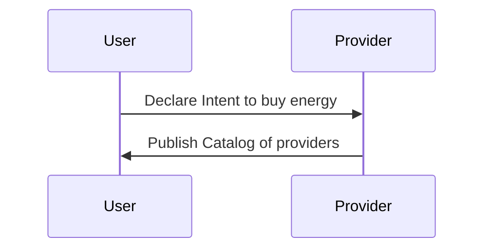
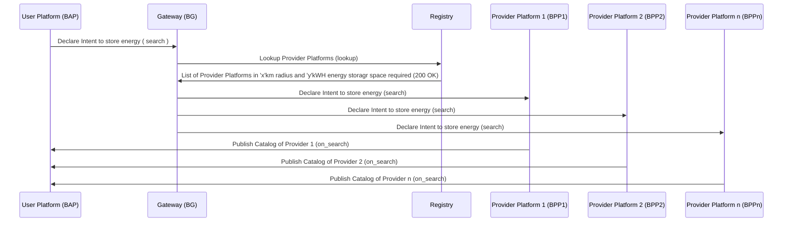
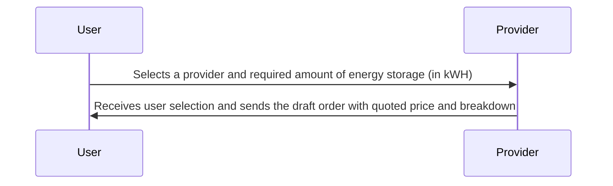
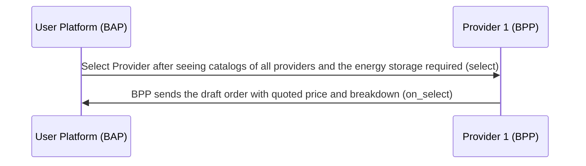
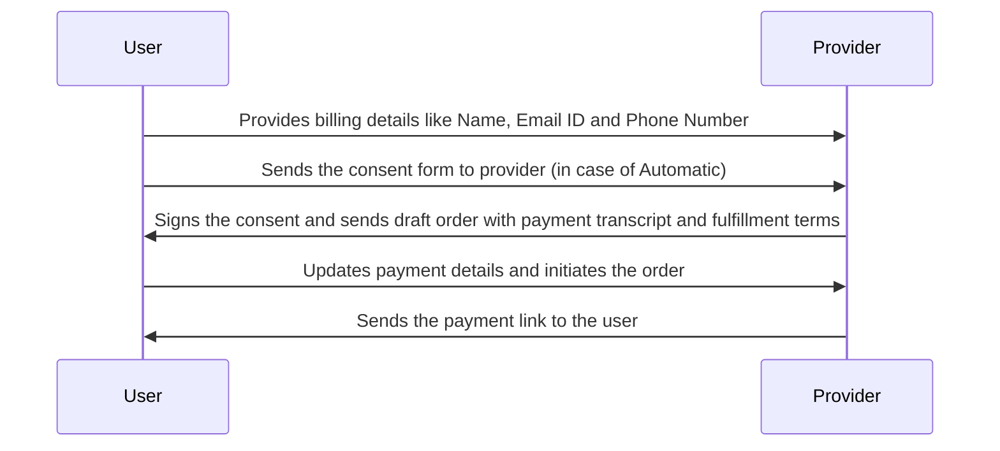
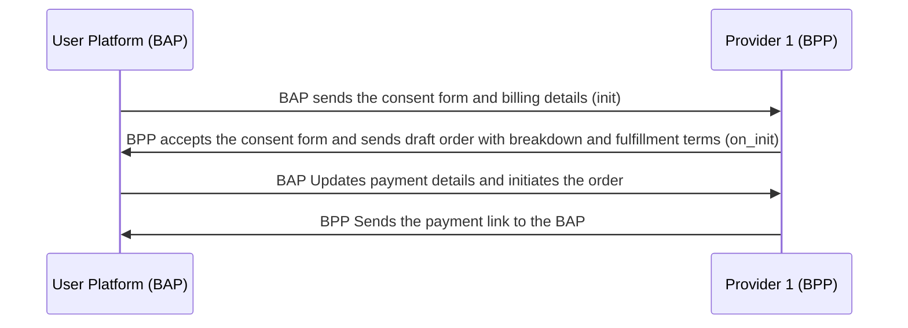
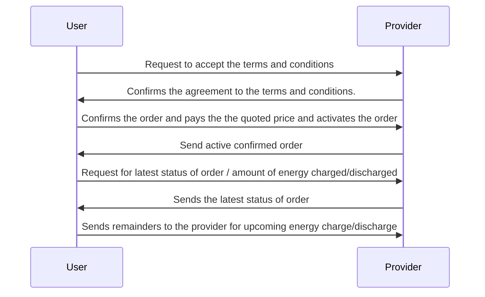
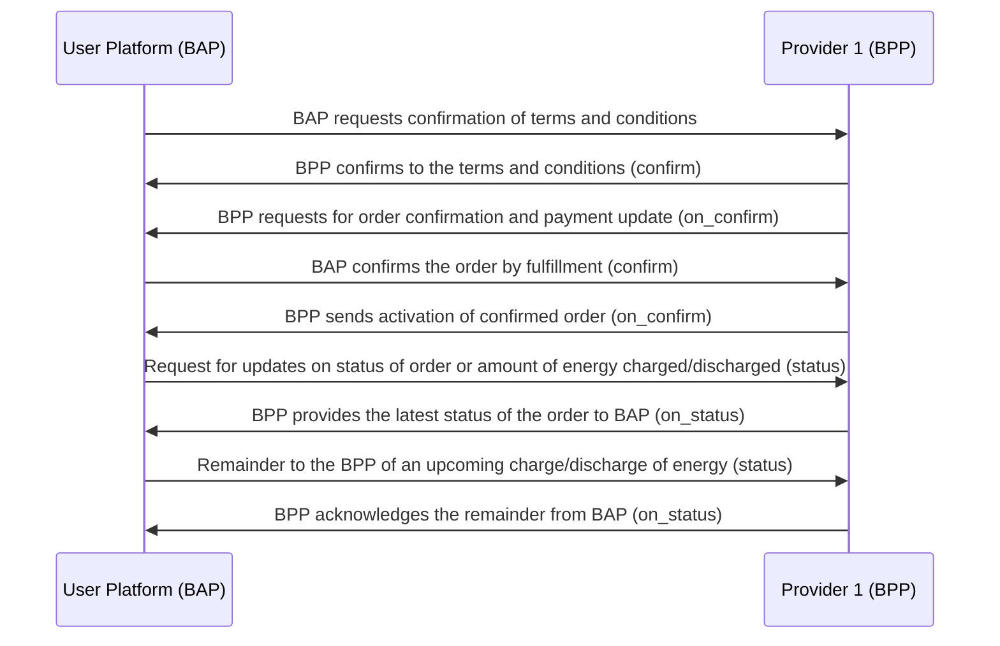

# General Energy Transaction Workflow #2

## Overview

This implementation guide outlines the energy transaction process where Sheru (Energy Aggregator) borrows energy storage devices or batteries from individuals or crowds to store and use up the energy when required, using the Beckn Protocol. The guide provides step-by-step instructions on how Sheru interacts with the Unified Energy Interface (UEI) to discover energy storage devices/batteries, select providers, initiate transactions, confirm orders, and monitor status updates.

## Important NOTE :

- During Automatic, the provider will sign a consent form such that upon the initiation of the energy transaction, access to both charging and discharging the energy from the battery or energy storage devices is completely given to UEI, until the transaction is completed.
- Since, only UEI has the control/access to charge and discharge the battery or energy storage devices, there is no need to use penalties.
- During Manual, the control/access is not given to UEI; rather, the provider him/herself will charge or discharge the energy.
- In this case, if the provider has not satisfied the terms and conditions he/she agreed upon during the transaction, then the provider has to pay the penalty for the amount of energy he/she was not able to provide.
- The form of energy charging and discharging, either automatic or manual, is completely the provider's choice, which is a `pre-select` feature for the provider.

Bear in mind that this is just an example workflow for a simple Energy transaction where Sheru borrows the Energy Storage from the individuals/crowd using UEI.

(Note: Here, User -> Sheru and Provider -> Individual/Crowd who is providing energy storage device or batteries and UEI -> Unified Energy Interface)

A typical workflow for EV Charging & Battery Swapping consists of the following steps:

#### Step 1: Discovery of Electricity

- The user searches providers who agree to the mode of Automatic or else Manual (which will act as a filter for search)
  1.  Automatic
      - Complete control of ?charge and discharge is given to the UEI.
  2.  Manual
      - Commit to providing the required energy storage for charging and return the stored energy while discharging; penalties for non-compliance are applicable.
- The user searches for providers who provides the greater than equal to amount of energy needed to be stored and used in kWH (which will act as a filter for the search).

#### Step 2: Provider platform sends catalogs of Individuals nearby

The UEI sends all the catalogs to the user.
The list of catalogs consists of:

- Individuals/Crowds from whom energy can be bought (Name, Phone Number, Email ID)
- Mode of Energy storage, provider has agreed upon (i.e, Automatic discharge / Manual Discharge)
- Available areas/locations for energy purchases
- Available amount of energy storage space (in kWH)
- Tariff per unit (in INR/kWH)
- Time of storage

#### Step 3: Sheru selects a Provider

The user selects a suitable individual/crowd provider from the list of provided catalogs, from either Automatic or else Manual
The user selects the required amount of energy storage space (in kWH)
The UEI notifies the chosen individual that Sheru intends to store energy

#### Step 4: Provider sends the draft order with quoted price

The provider acknowledges the notification sent by UEI for selling energy
The provider will receive the order based on the user's requirements. The user gets the quoted price, including the breakdown of the price details. The breakdown should include:

1.  Tariff per unit (i.e., INR/kWH), might change based on location of Energy Provider
2.  Amount of energy storage requested (in kWH)
3.  Price for energy (in INR) : (Amount of energy storage requested) x (Tariff per unit)
4.  Taxes: CGST & SGST

#### Step 5: Initiating the transaction

The user initializes the order by providing the billing details such as (Name, Phone Number, Email ID)
(in the case of Automatic Providers) The UEI requests the provider to accept the consent form (i.e., a check box) to take control/access to charge and discharging the battery/energy storage during Automatic

#### Step 6: Provider sends draft order

(In case of Automatic) The provider signs the consent letter (i.e., ticks the check box), which implies the provider is giving control to UEI for charging and discharging their battery or energy storage.
The provider sends the draft order with the payment link and fulfillment terms to the user's side.
A payment link is sent to user to complete the payment

#### Step 7: Provider accepts the terms and conditions

Provider confirms to satisfy the fulfillment terms and conditions (confirm)
If Provider selects Automatic discharge, no additional confirmation is needed.
If Provider selects Manual Discharge:

- Provider confirms commitment to fulfillment terms.
- If energy storage provision fails, a penalty is applicable.

#### Step 8: User confirms the order by payment fulfillment

User sees the confirmation of the provider for the fulfillment terms and conditions. (on_confirm)
Upon that, the user pays the quoted price for the draft order and activates the order by agreeing to the payment
The confirmation will sent to the provider through UEI, saying that user has paid the price and satisfies the fulfillment terms (confirm)
The UEI will activate the order after fulfillment of payment and confirmation of the user and provider, respectively. (on_confirm)

#### Step 9: User checks the status of the order

The user requests to fetch the order status/amount of charged/discharged energy in the battery

#### Step 10: UEI sends the status of the order

UEI provides status updates for the order (i.e., the amount of energy that has been charged/discharged so far).
UEI can send reminders to the provider for upcoming energy charging / discharging (manual or automatic).

## Search (Searching for Provider)

1. The user declares the intent to store and use up energy when required, to the providers
2. Providers publish the catalogs

### User-side Actions

A user can declare their intent to buy energy in many ways, like:

- Searching for Providers based on location
- Searching for Providers based on mode (Automatic/Manual)
- Searching for Providers based on quantity of energy storage space required (in kWH)
- Searching for Providers based on tariff per unit (in INR/kWH)
- Searching for Providers based on Name or Code of provider
- Searching for Providers based on ratings
- Viewing the catalog/details of services provided by a particular provider

### Provider-side Actions

In this interaction, the Provider publishes their catalog. The catalog mainly consits of :

- Individuals or crowds from whom energy can be bought.
- Full Name, Phone Number, Email-ID
- Locations where energy can be purchased (Address)
- Mode of charge and discharge (Automatic or Manual)
- Available amount of energy storage space (in kWH)
- Tariff per unit and available amount of energy

### Logical Workflow

### Beckn Protocol API Workflow

In beckn protocol, the search intent generated by the User Platform (BAP) is typically published on the gateway (BG) that broadcasts the intent to multiple Provider platforms (BPPs). Each of the BPPs returns their catalogs directly to the BAP via asynchronous callbacks. The workflow for that is shown below.

## Select and On_Select

1. User selects a Provider from the list which satisfies the requirements
2. User selects the required amount of energy they want to store (in kWH)
3. The BAP notifies the chosen Provider, so the provider sends the draft order with quoted price

### User-side Actions

- Selecting Provider after viewing catalogs and
- Selecting the required amount of energy needs to be stored
- BAP notifies the provider

### Provider-side Actions

- Receive user's selection
- Provider (BPP) will send quoted price along with breakdown for payment to the user for the service requested
- Breakdown:
  1. Tariff per unit (i.e., INR/kWH)
  2. Amount of energy storage space requested (in kWH)
  3. Price for energy (in INR)
  4. Taxes: CGST & SGST

### Logical Workflow

The below diagram illustrates the logical interactions between a User and Provider during the Selection stage

### Beckn Protocol API Workflow

## Order Initialization

In this stage, the User provides the required information and initiates the order

### User-side Actions

- User provides the billing details `Name`, `Email ID` and `Phone Number`
- (In the case of Automatic) The user sends the consent form to the provider for acceptance.
- User updates the payment details and initiates the order

### Provider-side Actions

- Request for billing details
- Receive billing details from the user and
- Provider accepts the consent form and signs it
- Send draft order with payment and fulfillment terms
- Sends the payment link to the user along with breakdown of price and taxes

### Logical Workflow

### Beckn Protocol API Workflow

## Fulfillment (Payment and Order Confirmation)

The provider has to confirm the fulfillment terms and conditions if he chooses Manual
Then, the User will check the order details and confirm the order with payment (might also update the order)
Post-payment, UEI will activate the confirmed order

### User-side Actions

- Confirms(\updates) the order by checking the order details and agreeing to fulfillment terms
- User pays the price after checking the confirmation of provider's terms and conditions
- Post fulfillment provider gets notified and UEI will lock the contract and activate the order

### Provider-side Actions

- If provider chosen Manual discharge, the provider has to confirm that he accepts the terms and conditions upon that only user can confirm the order and satisfy the fulfillment terms.
- Receive order confirmation from the user
- Send active, confirmed order to the user

## Status Updates and Monitoring

### User-side Actions

- Request to fetch the latest order status or amount of charged/discharged energy in the storage.
- Sends remainders to the provider for upcoming energy chagre/discharge (manual or automatic)

#### Provider-side Actions

- Provide the latest status of the order to the user

### Logical Worklow

### Beckn API Workflow

